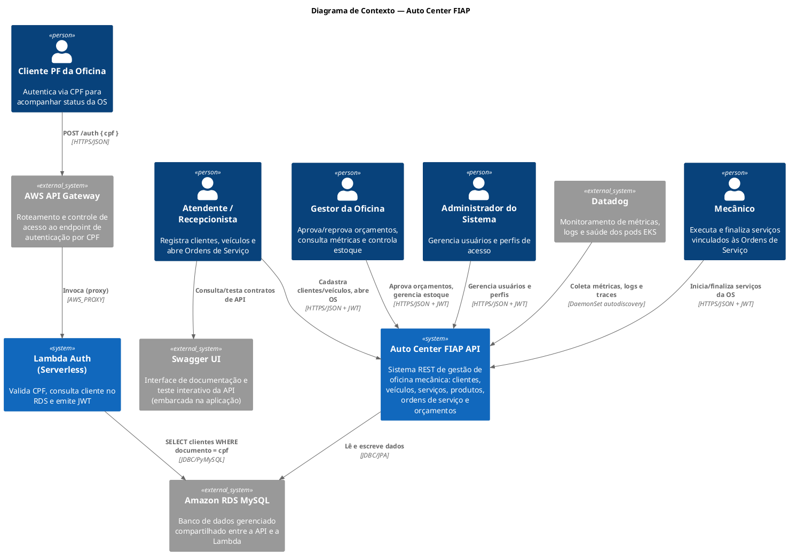
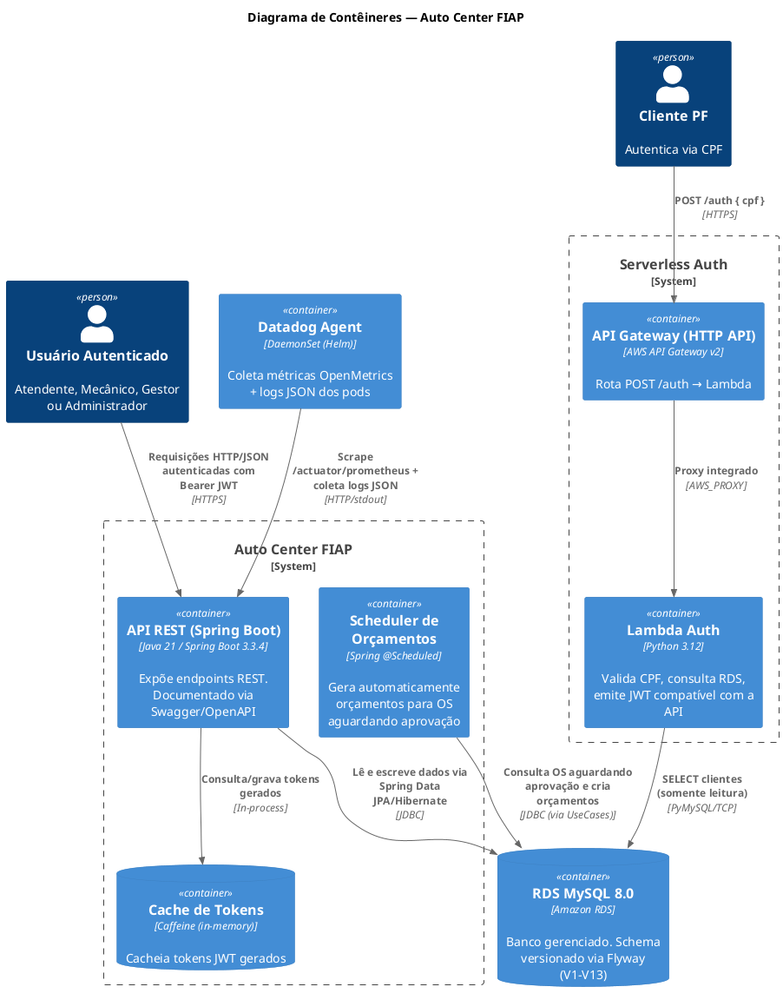
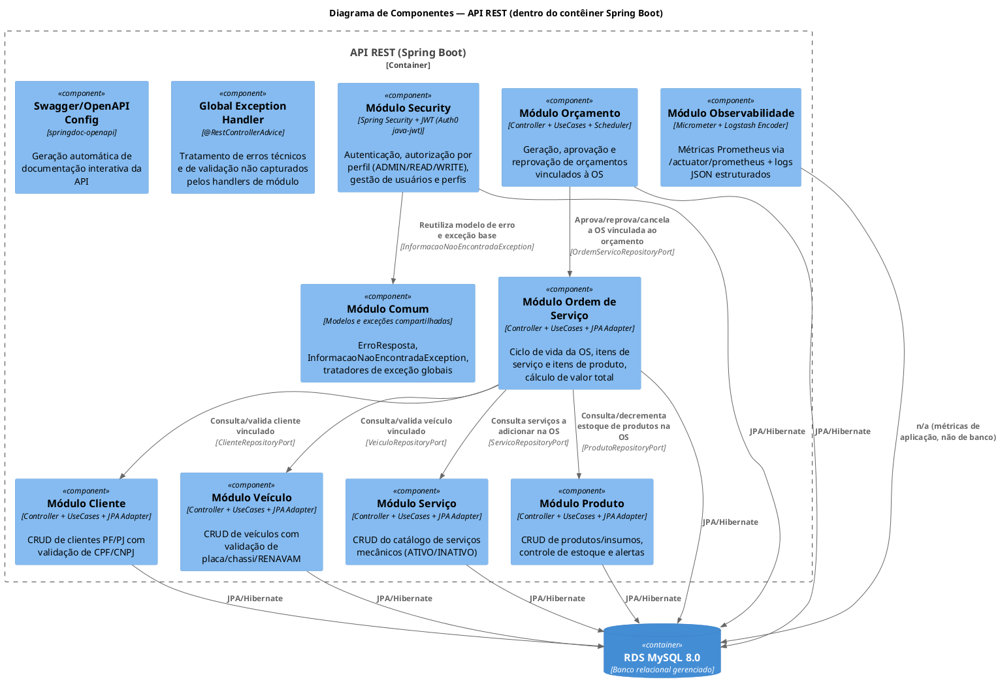
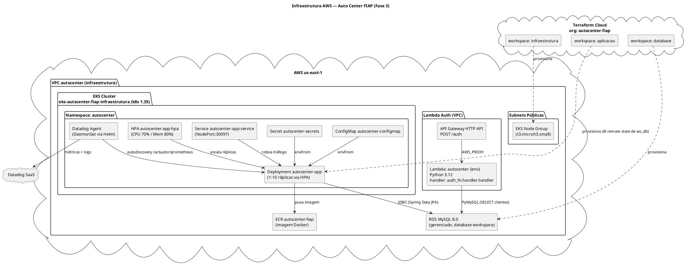
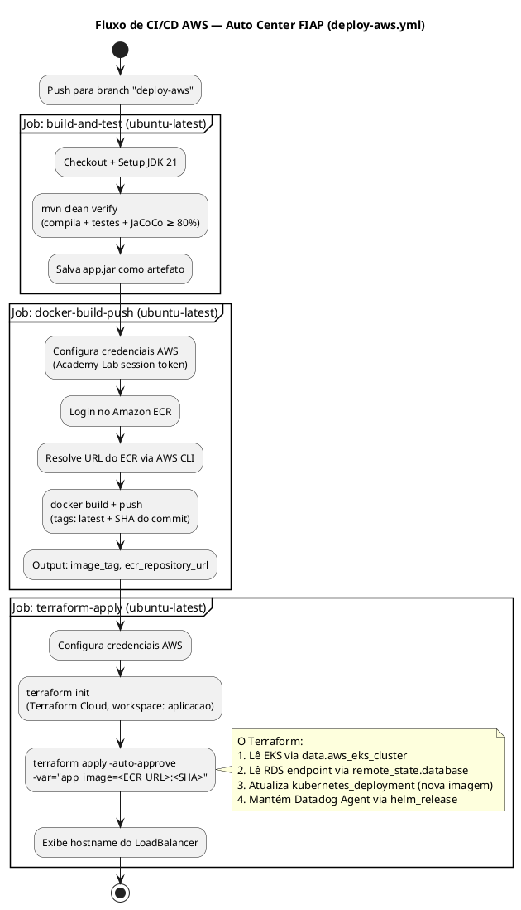
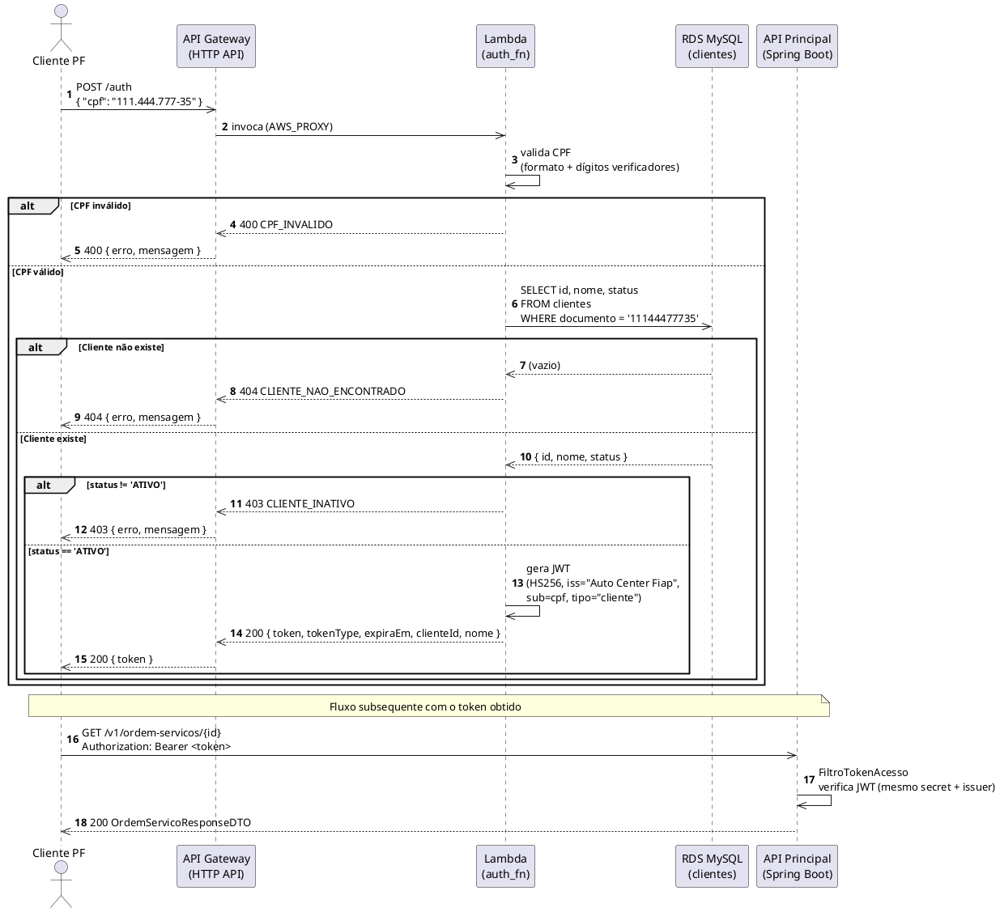
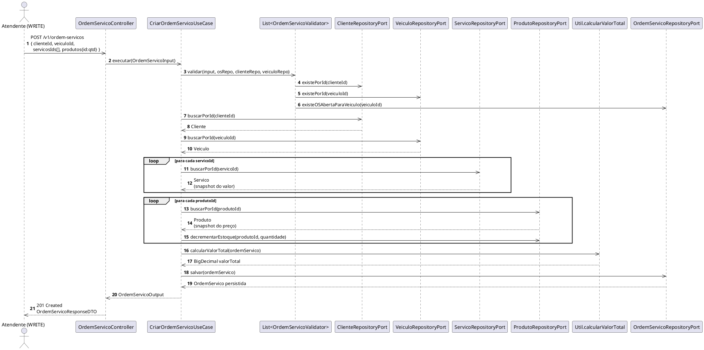
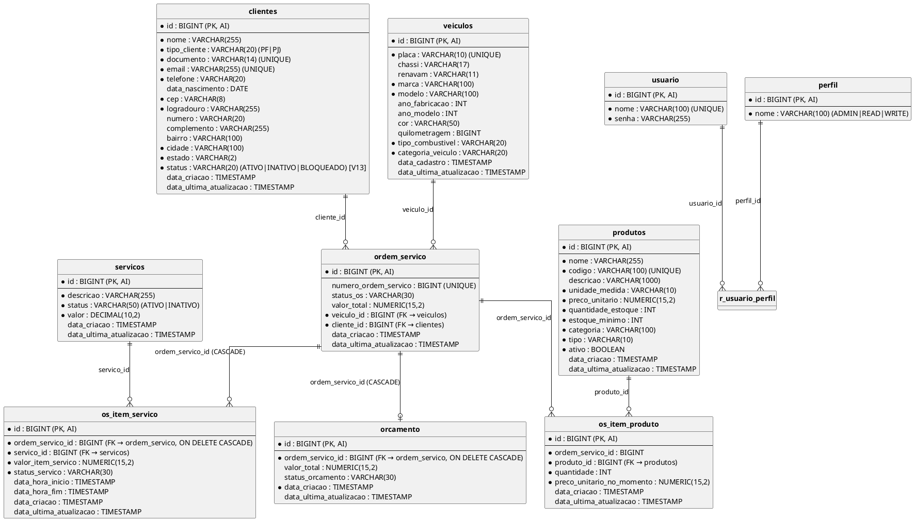

# Auto Center FIAP — Aplicação Principal

API REST de gestão de oficina mecânica automotiva, implantada em cluster Amazon EKS com banco RDS MySQL, autenticação serverless por CPF via AWS Lambda e monitoramento com Datadog.

## Repositórios do projeto

| Repositório | Link |
| --- | --- |
| Infraestrutura Kubernetes | [AutocenterFiap/infraestrutura](https://github.com/AutocenterFiap/infraestrutura) |
| Infraestrutura do Banco de Dados | [AutocenterFiap/database](https://github.com/AutocenterFiap/database) |
| Lambda / Function Serverless | [AutocenterFiap/autocenter-lambda-auth](https://github.com/AutocenterFiap/autocenter-lambda-auth) |
| Aplicação principal (este repositório) | [AutocenterFiap/autocenter](https://github.com/AutocenterFiap/autocenter) |

---

## Sumário

1. [Descrição do Projeto](#1-descrição-do-projeto)
2. [Arquitetura da Solução](#2-arquitetura-da-solução)
3. [Arquitetura Multi-Repositório](#3-arquitetura-multi-repositório)
4. [Componentes da Aplicação](#4-componentes-da-aplicação)
5. [Infraestrutura](#5-infraestrutura)
6. [Monitoramento e Observabilidade](#6-monitoramento-e-observabilidade)
7. [Fluxo de Deploy](#7-fluxo-de-deploy)
8. [API Gateway e Autenticação por CPF](#8-api-gateway-e-autenticação-por-cpf)
9. [Execução Local](#9-execução-local)
10. [Deploy Kubernetes (manifests locais)](#10-deploy-kubernetes-manifests-locais)
11. [Terraform — AWS EKS](#11-terraform--aws-eks)
12. [APIs](#12-apis)
13. [Estrutura do Projeto](#13-estrutura-do-projeto)
14. [Tecnologias Utilizadas](#14-tecnologias-utilizadas)
15. [Justificativa do Banco de Dados](#15-justificativa-do-banco-de-dados)
16. [ADRs — Architecture Decision Records](#16-adrs--architecture-decision-records)
17. [RFCs — Request for Comments](#17-rfcs--request-for-comments)
18. [Decisões Técnicas](#18-decisões-técnicas)
19. [Melhorias Futuras](#19-melhorias-futuras)

---

## 1. Descrição do Projeto

### 1.1 Objetivo do Sistema

O **Auto Center FIAP** é uma API REST para gestão integral de uma oficina mecânica automotiva. O sistema cobre o ciclo de vida completo de um atendimento de oficina: cadastro de clientes (pessoa física e jurídica), cadastro de veículos, catálogo de serviços mecânicos, controle de estoque de produtos/insumos, abertura e acompanhamento de Ordens de Serviço (OS), geração e aprovação de orçamentos, e autenticação/autorização de usuários internos via JWT.

Adicionalmente, o sistema expõe autenticação externa baseada em **CPF** para clientes finais da oficina, processada por uma **função serverless (AWS Lambda)** na frente de um **API Gateway**, integrando-se ao mesmo banco de dados relacional gerenciado (RDS MySQL).

### 1.2 Problema Resolvido

Oficinas mecânicas tradicionalmente controlam clientes, veículos, peças e ordens de serviço de forma manual ou fragmentada (planilhas, sistemas desconectados), o que gera:

- Falta de rastreabilidade do ciclo de vida de uma Ordem de Serviço (da abertura à entrega);
- Ausência de controle automatizado de estoque (entradas/saídas, alertas de estoque baixo/zerado);
- Inexistência de um fluxo formal de orçamento (geração, aprovação/reprovação do cliente) atrelado ao status da OS;
- Falta de controle de acesso e auditoria sobre quem pode criar, alterar ou remover informações sensíveis (dados de clientes, valores de serviços, estoque).

### 1.3 Objetivos desta Fase do Projeto (Fase 3 — Tech Challenge 13SOAT)

- Elevação da aplicação para operação em **nível corporativo** na nuvem AWS;
- Implementação de **API Gateway** e **autenticação serverless por CPF** (Lambda Python 3.12);
- Provisionamento de infraestrutura como código com **Terraform** gerenciado pelo **Terraform Cloud** (4 workspaces independentes: `infraestrutura`, `database`, `aplicacao` e estado local da Lambda);
- Deploy da aplicação em cluster **AWS EKS** (Kubernetes 1.35), com banco **RDS MySQL** gerenciado;
- Integração com **Datadog** para monitoramento de métricas, logs e saúde dos pods;
- Cobertura de testes automatizados (JUnit5/Mockito + `@SpringBootTest`/`@DataJpaTest`) com gate mínimo de **80% de cobertura de linha** (JaCoCo);
- Pipeline de **CI/CD** via GitHub Actions para todos os 4 repositórios.

---

## 2. Arquitetura da Solução

### 2.1 Padrão Arquitetural Utilizado

O projeto adota **Arquitetura Hexagonal (Ports & Adapters) combinada com Clean Architecture**, aplicada de forma consistente em todos os módulos de domínio (`cliente`, `veiculo`, `servico`, `produto`, `ordemservico`, `orcamento`, `security`). Cada módulo segue o mesmo empacotamento:

```
<modulo>/
├── domain/
│   ├── entity/         → Entidades de domínio puras (POJOs), sem anotações JPA
│   ├── enums/           → Enumerações de domínio
│   ├── exception/       → Exceções de regra de negócio (DomainException)
│   └── service/         → Interfaces de regras de domínio (ex: ValidadorDocumento)
├── application/
│   ├── usecase/         → Casos de uso (orquestração da regra de negócio)
│   ├── dto/             → Input/Output dos casos de uso (desacoplados de JPA e de REST)
│   ├── mapper/           → Conversão entre entidade de domínio e DTOs de aplicação
│   ├── port/             → Interfaces (contratos) que a camada de aplicação exige da infraestrutura
│   └── validator/        → Validadores de regra de negócio plugáveis (Strategy)
├── infrastructure/
│   ├── persistence/jpa/
│   │   ├── entity/       → Entidades JPA (anotadas com @Entity), independentes da entidade de domínio
│   │   ├── repository/   → Spring Data JpaRepository
│   │   ├── mapper/       → Conversão entre entidade JPA e entidade de domínio
│   │   └── adapter/      → Implementação dos "ports" de repositório (Adapter)
│   ├── config/           → Configuração Spring (@Configuration, definição de Beans de UseCase)
│   └── validator/        → Implementações concretas de validação (ex: ValidadorCpf, ValidadorCnpj)
└── adapter/in/
    ├── (Controller).java → Controladores REST (Spring MVC)
    ├── dto/               → Request/Response DTOs expostos via HTTP
    ├── mapper/            → Conversão entre DTO HTTP e DTO de aplicação
    └── exception/         → @RestControllerAdvice específico do módulo
```

### 2.2 Responsabilidades de Cada Camada

| Camada | Responsabilidade | Exemplo real no código |
|---|---|---|
| `domain` | Regras de negócio invariantes, validação de estado, transições permitidas | `StatusOS.podeMudarPara()`, `Produto.decrementarEstoque()`, `Cliente.validarDocumentoPorTipo()` |
| `application.usecase` | Orquestração de um fluxo de negócio ponta a ponta (buscar → validar → persistir) | `CriarOrdemServicoUseCase`, `AprovarOrcamentoUseCase`, `AdicionarProdutoNaOrdemServicoUseCase` |
| `application.port` | Contrato que a aplicação exige da infraestrutura (inversão de dependência) | `OrdemServicoRepositoryPort`, `ProdutoRepositoryPort`, `TokenPort` |
| `application.validator` | Validações plugáveis de regra de negócio, aplicadas via *Strategy* (lista de `OrdemServicoValidator`) | `OrdemServicoDuplicadaValidator`, `ClienteValidator`, `VeiculoValidator` |
| `infrastructure.persistence` | Implementação de persistência (JPA/Hibernate), tradução domínio ↔ entidade JPA | `ProdutoRepositoryJpaAdapter`, `OrdemServicoJpaMapper` |
| `infrastructure.config` | *Wiring* de Beans Spring (Configuration classes registram manualmente os UseCases) | `OrdemServicoConfiguration`, `ProdutoConfiguration`, `OrcamentoConfiguration` |
| `adapter.in` (Controller) | Exposição HTTP/REST, tradução de DTOs de borda, documentação Swagger | `ClienteController`, `OrdemServicoController`, `OSItemServicoController` |
| `adapter.exception` / `handler` | Tratamento centralizado de exceções por módulo (`@RestControllerAdvice`) | `ClienteExceptionHandler`, `ProdutoExceptionHandler`, `OrdemServicoExceptionHandler`, `GlobalExceptionHandler` |

### 2.3 Comunicação entre Componentes

- **Cliente HTTP → Controller:** requisições REST autenticadas via `Authorization: Bearer <JWT>` (exceto endpoints públicos: Swagger, H2 Console, `/v1/oauth/token`, `/v1/oauth/refresh-token`).
- **Controller → UseCase:** chamada direta em memória (mesmo processo, sem mensageria).
- **UseCase → Port → Adapter → JPA → RDS MySQL:** persistência via Spring Data JPA/Hibernate.
- **Comunicação entre módulos:** módulos se comunicam entre si através dos **ports de aplicação** de outros módulos. Exemplo: `CriarOrdemServicoUseCase` depende de `ClienteRepositoryPort`, `VeiculoRepositoryPort`, `ProdutoRepositoryPort` e `ServicoRepositoryPort`.
- **Segurança:** um `OncePerRequestFilter` (`FiltroTokenAcesso`) intercepta toda requisição, extrai o token JWT do header `Authorization`, valida via `TokenPort` (implementado por `Auth0TokenAdapter`, usando `com.auth0:java-jwt`) e popula o `SecurityContextHolder`.
- **Cache:** tokens gerados são cacheados via **Caffeine** (`@Cacheable(value = "tokens")`), com expiração configurável (`sistema.cache.expiracao.minutos`).
- **Scheduler:** `OrcamentoScheduler` executa periodicamente (`@Scheduled(fixedDelayString = "${orcamento.scheduler.fixedDelay}")`) o caso de uso `GerarOrcamentoUseCase`.

### 2.4 Decisões Arquiteturais

1. **Separação entre entidade de domínio e entidade JPA.** Cada módulo mantém uma entidade de domínio "pura" e uma entidade JPA equivalente, com mappers estáticos convertendo entre as duas.
2. **Injeção de casos de uso via `@Configuration` explícita**, e não via `@Service`/`@Component` nos próprios UseCases.
3. **Validators plugáveis via lista (`List<OrdemServicoValidator>`)** injetada no `CriarOrdemServicoUseCase`.
4. **Máquina de estados explícita no enum `StatusOS`**, com o método `podeMudarPara(StatusOS novoStatus)`.
5. **Tratamento de exceções descentralizado por módulo**, com fallback no `GlobalExceptionHandler`.
6. **Snapshot de preço no momento da transação.** `OSItemServico.valorItemServico` e `OSItemProduto.precoUnitarioNoMomento` são gravados no momento em que o item é adicionado à OS.
7. **Perfis de execução via Spring Profiles** (`dev`, `prod`, `test`).
8. **Secrets em produção via variáveis sensíveis do Terraform Cloud**, injetadas diretamente em `kubernetes_secret` no namespace `autocenter` do EKS.

### 2.5 Diagramas C4 Model (PlantUML)

#### 2.5.1 Diagrama de Contexto (System Context)



#### 2.5.2 Diagrama de Contêineres (Container Diagram)



#### 2.5.3 Diagrama de Componentes (Component Diagram)



---

## 3. Arquitetura Multi-Repositório

O Tech Challenge Fase 3 exige **segregação em 4 repositórios independentes**, cada um com seu próprio pipeline de CI/CD e responsabilidade bem delimitada. A organização Terraform Cloud utilizada é `autocenter-fiap`.

### 3.1 Mapa dos Repositórios

| # | Repositório | Workspace TC | Responsabilidade | Pipeline (branch) |
|---|---|---|---|---|
| 1 | `infraestrutura` | `infraestrutura` | VPC, subnets, security groups, EKS (v1.35), ECR, IAM roles | `main` (push) |
| 2 | `database` | `database` | RDS MySQL 8.0 (gerenciado), subnet group, security group do banco | `main` (push) |
| 3 | `autocenter-lambda-auth` | S3 por ambiente | Lambda Python 3.12, API Gateway HTTP API, IAM, CloudWatch Logs | `homolog` / `main` (push via PR) |
| 4 | `auto-center-fiap` (este) | `aplicacao` | Aplicação Spring Boot (EKS), Datadog Agent (Helm) | `deploy-aws` (push) |

### 3.2 Dependências entre Repositórios

```
infraestrutura ──outputs──► auto-center-fiap (aplicacao)
                               └─ lê eks_cluster_name via data source aws_eks_cluster
                               └─ lê ecr_repository_url via aws ecr describe-repositories

infraestrutura ──outputs──► autocenter-lambda-auth
                               └─ vpc_id, subnet_ids, rds_security_group_id (via vars do pipeline)

database ──remote_state──► auto-center-fiap (aplicacao)
                               └─ rds_endpoint, rds_port via terraform_remote_state.database

database ──vars do pipeline──► autocenter-lambda-auth
                               └─ db_host, db_name, db_user (via GitHub Variables)
```

### 3.3 Fluxo de Provisionamento (ordem obrigatória)

```
1. infraestrutura  → cria VPC, EKS, ECR
        ↓
2. database        → cria RDS na VPC do passo 1
        ↓
3. autocenter-lambda-auth → cria Lambda + API Gateway (consome VPC e RDS)
        ↓
4. auto-center-fiap → deploy da aplicação no EKS (consome EKS + ECR + RDS)
```

### 3.4 Diagrama de Infraestrutura AWS (PlantUML)



---

## 4. Componentes da Aplicação

### 4.1 API REST (Spring Boot)

- **Responsabilidade:** único ponto de entrada para todas as operações do sistema — clientes, veículos, serviços, produtos, ordens de serviço, orçamentos, usuários e autenticação interna.
- **Tecnologias:** Java 21, Spring Boot 3.3.4 (Web, Validation, Security, Data JPA, Cache, Actuator), springdoc-openapi 2.3.0.
- **Observabilidade:** `micrometer-registry-prometheus` expõe métricas em `/actuator/prometheus`; `logstash-logback-encoder` produz logs JSON estruturados.
- **Ponto de entrada:** `br.com.autocenterfiap.StartApplication` (`@SpringBootApplication`, `@EnableCaching`, `@EnableScheduling`, `@EnableJpaAuditing`).

### 4.2 Banco de Dados

- **Responsabilidade:** persistência transacional de todo o domínio da oficina.
- **Tecnologias:**
  - **RDS MySQL 8.0** em produção (workspace `database`, driver `com.mysql.cj.jdbc.Driver`);
  - **H2 em memória** em desenvolvimento (`application-dev.properties`, modo `MODE=MySQL`) e em testes (`application-test.properties`);
  - **Flyway** controla o versionamento incremental do schema (**V1 a V13**), com `baseline-on-migrate=true`.

### 4.3 Serviços de Domínio (Casos de Uso)

| Módulo | Casos de uso principais |
|---|---|
| Cliente | `CriarClienteUseCase`, `AtualizarClienteUseCase`, `BuscarClientePorIdUseCase`, `BuscarClientePorDocumentoUseCase`, `ListarClientesUseCase`, `DeletarClienteUseCase` |
| Veículo | `CriarVeiculoUseCase`, `AtualizarVeiculoUseCase`, `BuscarVeiculoPorIdUseCase`, `BuscarVeiculoPorPlacaUseCase`, `ListarVeiculosUseCase`, `DeletarVeiculoUseCase` |
| Serviço | `CriarServicoUseCase`, `AtualizarServicoUseCase`, `BuscarServicoPorIdUseCase`, `ListarServicosUseCase`, `ListarServicosPorStatusUseCase`, `DeletarServicoUseCase` |
| Produto | `CriarProdutoUseCase`, `AtualizarProdutoUseCase`, `BuscarProdutoPorIdUseCase`, `ListarProdutosUseCase`, `AdicionarEstoqueUseCase`, `RemoverEstoqueUseCase`, `DesativarProdutoUseCase`, `ListarAlertasEstoqueUseCase` |
| Ordem de Serviço | `CriarOrdemServicoUseCase`, `AtualizarOrdemServicoUseCase`, `BuscarOrdemServicoPorIdUseCase`, `BuscarOrdemServicoPorNumeroUseCase`, `ListarTodasOrdensServicosUseCase`, `DeletarOrdemServicoUseCase` |
| Item de Serviço da OS | `AdicionarServicoOrdemServicoUseCase`, `RemoverServicoDaOrdemServicoUseCase`, `IniciarServicoUseCase`, `FinalizarServicoUseCase`, `ListarTodosPorOrdemServicoUseCase`, `BuscarMetricasTempoGastoServicoUseCase` |
| Item de Produto da OS | `AdicionarProdutoNaOrdemServicoUseCase`, `AtualizarQuantidadeUseCase`, `RemoverProdutoNaOrdemServicoUseCase`, `ListarTodosPorOrdemServicoUseCase` |
| Orçamento | `CriarOrcamentoUseCase`, `GerarOrcamentoUseCase`, `AprovarOrcamentoUseCase`, `ReprovarOrcamentoUseCase`, `BuscarOrcamentoPorIdUseCase`, `BuscarTodosOrcamentosUseCase` |
| Segurança | `SalvarUsuarioUseCase`, `BuscarUsuarioPorNomeUseCase`, `BuscarUsuarioComPerfisUseCase`, `AlterarSenhaUseCase` |

### 4.4 Workers / Jobs Agendados

- **`OrcamentoScheduler`** (`@Scheduled(fixedDelayString = "${orcamento.scheduler.fixedDelay}")`): executa periodicamente `GerarOrcamentoUseCase.executar()`, que consulta todas as OS com status `AGUARDANDO_APROVACAO` (paginado, 100 por vez) e cria um `Orcamento` no status `AGUARDANDO_APROVACAO` para cada OS que ainda não possua orçamento pendente. O intervalo é parametrizado via `orcamento.scheduler.fixedDelay` (60000 ms nos três perfis — dev, test e prod).

### 4.5 Cache

- **Caffeine**, configurado em `CacheConfig`: cache nomeado `"tokens"`, com expiração após escrita configurável via `sistema.cache.expiracao.minutos` (25 minutos) e tamanho máximo de 1000 entradas. Usado por `Auth0TokenAdapter.gerarToken()` (`@Cacheable`) e invalidado por `limparCache()` (`@CacheEvict`).

---

## 5. Infraestrutura

### 5.1 Kubernetes — Manifests Locais (`k8s/`)

Os manifests em `k8s/` são usados para deploy em **clusters locais** (Kind/Minikube) via pipeline `ci-cd.yml` com self-hosted runner, e utilizam **Infisical** como gerenciador de secrets via init container.

| Recurso | Manifesto | Descrição |
|---|---|---|
| Namespace | `k8s/namespace.yaml` | Namespace `auto-center` |
| ConfigMap | `k8s/configmap.yaml` | Variáveis não sensíveis: profile ativo (`prod`), porta, URL JDBC, config Flyway/Hibernate |
| Secret | `k8s/secret.yaml` (não versionado — `.gitignore`) | Credenciais MySQL e do Infisical |
| PVC | `k8s/mysql-pvc.yaml` | Volume persistente de 10Gi para dados do MySQL (`ReadWriteOnce`) |
| Deployment MySQL | `k8s/mysql-deployment.yaml` | MySQL 8.0, estratégia `Recreate`, liveness/readiness via `mysqladmin ping` |
| Service MySQL | `k8s/mysql-service.yaml` | `ClusterIP`, porta 3306 |
| Deployment App | `k8s/app-deployment.yaml` | 2 réplicas, `RollingUpdate`, 2 init containers (`wait-for-mysql`, `infisical-secrets-fetcher`), liveness/readiness em `/actuator/health/*` |
| Service App | `k8s/app-service.yaml` | `LoadBalancer`, porta 80 → 8097 |
| HPA | `k8s/hpa.yaml` | Autoscaling 2–10 réplicas, CPU 70% e memória 80% |
| Kustomize | `k8s/kustomization.yaml` | Orquestra a aplicação ordenada de todos os manifests |

> **Atenção:** os init containers `wait-for-mysql` e `infisical-secrets-fetcher` presentes em `k8s/app-deployment.yaml` são exclusivos do fluxo local. No fluxo AWS (Terraform + EKS), **não há Infisical** — as credenciais são provisionadas diretamente via `kubernetes_secret` gerenciado pelo Terraform Cloud.

### 5.2 Kubernetes — AWS EKS (Terraform)

Os recursos Kubernetes no cluster EKS são gerenciados pelo Terraform (workspace `aplicacao`). Veja a seção [11. Terraform — AWS EKS](#11-terraform--aws-eks) para detalhes completos.

| Recurso Terraform | Namespace | Descrição |
|---|---|---|
| `kubernetes_namespace.autocenter` | — | Namespace `autocenter` (distinto do `auto-center` local) |
| `kubernetes_secret.autocenter` | `autocenter` | `SPRING_DATASOURCE_USERNAME/PASSWORD`, `SISTEMA_SEGURANCA_CHAVE_SECRETA` |
| `kubernetes_config_map.autocenter` | `autocenter` | Variáveis não sensíveis: URL RDS (lida do remote state `database`), perfil `prod`, porta 8097, Flyway, JPA |
| `kubernetes_deployment.autocenter_app` | `autocenter` | 1 réplica inicial, `RollingUpdate`, probes HTTP em `/actuator/health/*`, variáveis DD_* do Datadog |
| `kubernetes_service.autocenter_app` | `autocenter` | `NodePort`, porta 80 → 8097 (nodePort: 30097) |
| `kubernetes_horizontal_pod_autoscaler_v2.autocenter_app` | `autocenter` | HPA 1–10 réplicas, CPU 70%, memória 80% |
| `helm_release.datadog` | `autocenter` | Datadog Agent v3.99.0 (DaemonSet, logs + métricas, APM desabilitado) |

---

## 6. Monitoramento e Observabilidade

O Datadog está **completamente implementado** no stack de produção (AWS EKS), coletando métricas, logs e executando health checks dos pods.

### 6.1 Componentes Implementados

| Componente | Implementação | Detalhe |
|---|---|---|
| **Datadog Agent** | `terraform/datadog.tf` | Helm chart `datadog/datadog` v3.99.0, instalado como DaemonSet no namespace `autocenter` |
| **Métricas (OpenMetrics)** | Anotação `ad.datadoghq.com/autocenter-fiap.checks` nos pods | Scrape de `/actuator/prometheus` com namespace `autocenter` e filtro `autocenter_*` |
| **Logs JSON** | Anotação `ad.datadoghq.com/autocenter-fiap.logs` nos pods | `source: spring-boot`, `service: auto-center-fiap`; logs JSON produzidos via `logstash-logback-encoder` |
| **Métricas da app** | `pom.xml`: `micrometer-registry-prometheus` | Expostas em `/actuator/prometheus` (Micrometer); incluem métricas da JVM, HTTP, Hikari pool, cache |
| **APM** | Desabilitado | `apm.portEnabled: false` — a aplicação não possui instrumentação de tracing e os nodes t3.micro não têm capacidade para o trace-agent |
| **Cluster Agent** | Desabilitado | `clusterAgent.enabled: false` — economia de recursos nos nodes t3.micro |
| **Tags Datadog** | Variáveis de ambiente nos pods | `DD_ENV=prod`, `DD_SERVICE=auto-center-fiap`, `DD_VERSION=1.0.0`, `DD_LOGS_INJECTION=true` |

### 6.2 Configuração dos Pods (Autodiscovery)

As anotações no `kubernetes_deployment.autocenter_app` ativam a coleta automática pelo Datadog Agent:

```json
// ad.datadoghq.com/autocenter-fiap.checks
{
  "openmetrics": {
    "instances": [{
      "prometheus_url": "http://%%host%%:8097/actuator/prometheus",
      "namespace": "autocenter",
      "metrics": ["autocenter_*"]
    }]
  }
}

// ad.datadoghq.com/autocenter-fiap.logs
[{ "source": "spring-boot", "service": "auto-center-fiap" }]
```

### 6.3 Métricas Disponíveis

| Categoria | Métricas expostas |
|---|---|
| HTTP | `http_server_requests_seconds_*` (latência, contagem, erros por endpoint) |
| JVM | `jvm_memory_*`, `jvm_gc_*`, `jvm_threads_*` |
| Cache (Caffeine) | `cache_gets_*`, `cache_puts_*`, `cache_evictions_*` |
| Pool de conexões | `hikaricp_connections_*` (ativas, pendentes, timeout) |
| Kubernetes | CPU e memória dos pods coletados pelo DaemonSet |

### 6.4 Logs Estruturados

A aplicação emite logs em **JSON** via `logstash-logback-encoder`, com os campos:

```json
{
  "timestamp": "2026-09-14T18:30:00.000Z",
  "level": "INFO",
  "logger_name": "br.com.autocenterfiap.ordemservico...",
  "message": "Ordem de serviço criada: 12345",
  "dd.trace_id": "...",
  "dd.span_id": "...",
  "dd.service": "auto-center-fiap",
  "dd.env": "prod"
}
```

O campo `dd.trace_id` é injetado automaticamente via `DD_LOGS_INJECTION=true`.

### 6.5 Dashboards Recomendados (Datadog)

| Dashboard | Métricas-chave |
|---|---|
| Volume de Ordens de Serviço | `http_server_requests_seconds_count{uri="/v1/ordem-servicos", method="POST"}` |
| Tempo médio por status da OS | `http_server_requests_seconds_sum / http_server_requests_seconds_count` por endpoint de status |
| Erros e falhas | `http_server_requests_seconds_count{status=~"5.."}` |
| Saúde dos pods | CPU/memória dos pods `app=autocenter-fiap` (coletados pelo DaemonSet) |
| Pool de conexões | `hikaricp_connections_active`, `hikaricp_connections_timeout_total` |

---

## 7. Fluxo de Deploy

O repositório possui **três workflows** de GitHub Actions com finalidades distintas.

### 7.1 Workflows Disponíveis

| Arquivo | Disparo | Finalidade |
|---|---|---|
| `.github/workflows/ci-cd.yml` | Push/PR em `main`, `clean-architecture` | Build + testes + deploy em Kubernetes **local** (self-hosted runner) |
| `.github/workflows/deploy-aws.yml` | Push em `deploy-aws` | Build + testes + push ECR + Terraform Apply no EKS **AWS** |
| `.github/workflows/deploy-aws-manual.yml` | `workflow_dispatch` (manual) | Mesmo fluxo do `deploy-aws.yml`, acionado manualmente |

---

### 7.2 Workflow: `ci-cd.yml` — Deploy Kubernetes Local

Utiliza self-hosted runner (máquina local com Kind/Minikube) para os jobs de Docker e deploy.

```
Job 1: build-and-test (ubuntu-latest)
  ├─ Checkout
  ├─ Setup JDK 21 (Temurin) + cache Maven
  ├─ mvn clean verify (compila + testes + JaCoCo ≥ 80%)
  └─ Publica artefatos: surefire-reports/, jacoco/, app.jar

Job 2: docker-build (self-hosted) ← depende de build-and-test
  ├─ docker build -f docker/Dockerfile -t auto-center-fiap:latest
  ├─ minikube image load auto-center-fiap:latest (se Minikube ativo)
  └─ kind load docker-image auto-center-fiap:latest (se Kind ativo)

Job 3: deploy-database (self-hosted) ← depende de docker-build
  ├─ kubectl apply namespace.yaml + configmap.yaml
  ├─ kubectl create secret auto-center-secrets (idempotente)
  ├─ Recria PVC + Deployment MySQL (fresh start)
  └─ kubectl wait pod mysql Ready (timeout 180s)

Job 4: deploy-app (self-hosted) ← depende de deploy-database
  ├─ kubectl delete deployments antigos (evita erro de spec.selector imutável)
  ├─ kubectl apply -k k8s/ (Kustomize)
  └─ kubectl rollout status deployment/auto-center-fiap (timeout 300s)
```

**Secrets necessários (GitHub Actions):**
```
MYSQL_ROOT_PASSWORD, MYSQL_DATABASE, MYSQL_USER, MYSQL_PASSWORD
INFISICAL_CLIENT_ID, INFISICAL_CLIENT_SECRET, INFISICAL_PROJECT_ID
```

---

### 7.3 Workflow: `deploy-aws.yml` — Deploy AWS EKS (Principal)

Todos os jobs rodam em `ubuntu-latest`. Não usa Infisical — secrets vêm do Terraform Cloud.

```
Job 1: build-and-test (ubuntu-latest)
  ├─ Checkout
  ├─ Setup JDK 21 (Temurin) + cache Maven
  ├─ mvn clean verify --batch-mode (compila + testes + JaCoCo ≥ 80%)
  └─ Salva app.jar como artefato (retention: 1 dia)

Job 2: docker-build-push (ubuntu-latest) ← depende de build-and-test
  ├─ Configura credenciais AWS (Academy Lab: key + secret + session token)
  ├─ aws-actions/amazon-ecr-login@v2
  ├─ Resolve URL do ECR via: aws ecr describe-repositories --repository-names autocenter-fiap
  ├─ docker build -f docker/Dockerfile -t <ECR_URL>:latest -t <ECR_URL>:<SHA>
  └─ docker push <ECR_URL>:latest && docker push <ECR_URL>:<SHA>
       outputs: image_tag (github.sha), ecr_repository_url

Job 3: terraform-apply (ubuntu-latest) ← depende de docker-build-push
  ├─ Configura credenciais AWS
  ├─ hashicorp/setup-terraform@v3 (com TF_API_TOKEN → Terraform Cloud)
  ├─ terraform init (backend: Terraform Cloud, workspace: aplicacao)
  └─ terraform apply -auto-approve -var="app_image=<ECR_URL>:<SHA>"
       └─ Exibe terraform output -raw app_service_hostname
```

**Secrets necessários (GitHub Actions):**

| Secret | Descrição |
| --- | --- |
| `AWS_ACCESS_KEY_ID` | Credencial temporária do AWS Academy Lab |
| `AWS_SECRET_ACCESS_KEY` | Credencial temporária do AWS Academy Lab |
| `AWS_SESSION_TOKEN` | Credencial temporária do AWS Academy Lab |
| `TF_API_TOKEN` | Token de API do Terraform Cloud (org: `autocenter-fiap`) |

As credenciais AWS são temporárias. Sempre que a sessão do Academy Lab expirar, atualize `AWS_ACCESS_KEY_ID`, `AWS_SECRET_ACCESS_KEY` e `AWS_SESSION_TOKEN` juntos nos Secrets do GitHub antes de executar um novo deploy.

**Variáveis sensíveis no Terraform Cloud (workspace `aplicacao`):**

| Variável | Descrição |
| --- | --- |
| `db_username` | Usuário do MySQL no RDS |
| `db_password` | Senha do MySQL no RDS |
| `jwt_secret` | Chave HMAC256 para tokens JWT (compartilhada com a Lambda) |
| `dd_api_key` | API Key do Datadog |

### Regras de proteção de branch

- A branch `main` é protegida — commits diretos são bloqueados.
- Merges somente via Pull Request revisado.
- O deploy em produção (branch `deploy-aws`) é executado automaticamente pelo pipeline após o merge.

### 7.4 Fluxograma do Deploy AWS (PlantUML)



---

## 8. API Gateway e Autenticação por CPF

### 8.1 Visão Geral

A autenticação de **clientes finais da oficina** é feita por CPF, processada por uma **função AWS Lambda** (Python 3.12) acessível via **AWS API Gateway HTTP API**. O JWT emitido pela Lambda é assinado com o **mesmo secret e issuer** da aplicação principal — portanto, é aceito diretamente pelos endpoints protegidos sem round-trip adicional.

- **Repositório:** `autocenter-lambda-auth`
- **Endpoint:** `POST <API_GATEWAY_URL>/auth`
- **Runtime:** Python 3.12
- **Handler:** `auth_fn.handler.handler`

### 8.2 Fluxo de Autenticação

```
POST /auth { "cpf": "111.444.777-35" }
         ↓
API Gateway HTTP API (AWS API Gateway v2)
         ↓ AWS_PROXY
Lambda auth_fn.handler.handler
    1. Extrai CPF do body
    2. Valida formato + dígitos verificadores (cpf.cpf_valido)
    3. SELECT id, nome, status FROM clientes WHERE documento = <cpf_normalizado>
    4. Verifica status == 'ATIVO' (V13: ATIVO | INATIVO | BLOQUEADO)
    5. Gera JWT: HS256, iss="Auto Center Fiap", sub=<cpf>, tipo="cliente", clienteId, nome
         ↓
Response 200: { token, tokenType: "Bearer", expiraEm, clienteId, nome }
```

### 8.3 Respostas de Erro

| HTTP | Código | Condição |
|---|---|---|
| 400 | `CPF_INVALIDO` | Formato inválido ou dígitos verificadores incorretos |
| 404 | `CLIENTE_NAO_ENCONTRADO` | CPF não cadastrado na tabela `clientes` |
| 403 | `CLIENTE_INATIVO` | Status do cliente é `INATIVO` ou `BLOQUEADO` |
| 500 | `ERRO_INTERNO` | Qualquer exceção inesperada (stacktrace nunca vaza ao cliente) |

### 8.4 Infraestrutura da Lambda (Terraform — `autocenter-lambda-auth/terraform/`)

| Recurso AWS | Detalhe |
|---|---|
| `aws_lambda_function.auth` | Runtime Python 3.12, VPC config (subnet IDs + security group), timeout e memory configuráveis |
| `aws_apigatewayv2_api.http` | HTTP API (v2), nome `autocenter-{env}-api` |
| `aws_apigatewayv2_route.auth` | `POST /auth` → integração AWS_PROXY com a Lambda |
| `aws_apigatewayv2_stage.default` | Stage `$default`, auto-deploy, logs em CloudWatch |
| `aws_cloudwatch_log_group.lambda` | `/aws/lambda/autocenter-{env}`, retenção 14 dias |
| `aws_cloudwatch_log_group.api` | `/aws/apigateway/autocenter-{env}`, retenção 14 dias |
| `aws_security_group_rule.rds_ingress_from_lambda` | Libera a Lambda a conectar no security group do RDS |

**Secrets:** lidos do **AWS Secrets Manager** (`data.aws_secretsmanager_secret_version`) e injetados como variáveis de ambiente da Lambda: `JWT_SECRET`, `DB_PASSWORD`.

### 8.5 Interoperabilidade do JWT

O JWT emitido pela Lambda é aceito pelo filtro `FiltroTokenAcesso` do app principal sem nenhuma alteração, pois usa:
- Algoritmo: **HS256**
- Issuer: **`"Auto Center Fiap"`** (mesmo valor do app)
- Secret: **o mesmo** (`SISTEMA_SEGURANCA_CHAVE_SECRETA`) armazenado no AWS Secrets Manager
- Claim extra `"tipo": "cliente"` distingue tokens de clientes externos dos tokens de usuários internos (`ADMIN`/`READ`/`WRITE`)

### 8.6 Diagrama de Sequência — Autenticação por CPF



### 8.7 Diagrama de Sequência — Criação de Ordem de Serviço



---

## 9. Execução Local

### 9.1 Requisitos

- **Java 21** (JDK)
- **Maven** (ou usar o wrapper `./mvnw`)
- **Docker** e **Docker Compose** (para execução com MySQL local)

### 9.2 Opção A — Execução rápida com H2 em memória (perfil `dev`)

```bash
./mvnw spring-boot:run -Dspring-boot.run.profiles=dev
```

A API sobe em `http://localhost:8097`.

- **Console H2:** `http://localhost:8097/h2-console`
- **Swagger UI:** `http://localhost:8097/swagger-ui.html`

### 9.3 Opção B — Execução com MySQL via Docker Compose

```bash
cd docker/
docker-compose up -d
```

O `docker-compose.yml` sobe dois serviços:

- **`mysql`**: imagem `mysql:8.0`, banco `autocenterdb`, usuário `autocenter`/senha `autocenter123`, porta `3306`;
- **`autocenterfiap`**: build a partir de `docker/Dockerfile`, porta `8097`, aguardando healthcheck do MySQL.

### 9.4 Variáveis de Ambiente Relevantes

| Variável | Uso | Perfil |
|---|---|---|
| `SPRING_DATASOURCE_URL` | URL JDBC do banco | prod / docker-compose |
| `SPRING_DATASOURCE_USERNAME` / `SPRING_DATASOURCE_PASSWORD` | Credenciais do banco | prod / docker-compose |
| `sistema.seguranca.chave.secreta` | Chave HMAC256 usada para assinar/validar tokens JWT | todos |
| `sistema.token.expiracao.minutos` | Tempo de expiração do access token | todos (30 min) |
| `sistema.cache.expiracao.minutos` | Tempo de expiração do cache Caffeine de tokens | todos (25 min) |
| `orcamento.scheduler.fixedDelay` | Intervalo (ms) do job de geração automática de orçamentos | todos (60000 ms) |
| `SPRING_PROFILES_ACTIVE` | Seleciona o perfil ativo (`dev`, `prod`, `test`) | Docker/K8s |

### 9.5 Autenticação Local

O usuário administrador padrão é inserido pela migration `V5__cria_insere_dados_usuarios.sql`:

```bash
curl -X POST http://localhost:8097/v1/oauth/token \
  -H "Content-Type: application/json" \
  -d '{"nome": "ADMIN", "senha": "ADMIN"}'
```

### 9.6 Testes

```bash
./mvnw test
# ou, incluindo o gate de cobertura JaCoCo:
./mvnw clean verify
```

---

## 10. Deploy Kubernetes (manifests locais)

### 10.1 Pré-requisitos

- `kubectl` configurado apontando para o cluster de destino;
- Imagem Docker disponível no daemon Docker do cluster (Kind/Minikube) ou num registry acessível;
- Metrics Server instalado no cluster (necessário para o HPA funcionar).

### 10.2 Configuração de Secrets

Crie o arquivo `k8s/secret.yaml` (não versionado — `.gitignore`) com os valores reais:

```yaml
apiVersion: v1
kind: Secret
metadata:
  name: auto-center-secrets
  namespace: auto-center
stringData:
  SPRING_DATASOURCE_USERNAME: "autocenter_user"
  SPRING_DATASOURCE_PASSWORD: "SUA_SENHA_AQUI"
  MYSQL_ROOT_PASSWORD: "SUA_SENHA_ROOT_AQUI"
  MYSQL_USER: "autocenter_user"
  MYSQL_PASSWORD: "SUA_SENHA_AQUI"
  SISTEMA_SEGURANCA_CHAVE_SECRETA: "CHAVE_JWT_256_BITS"
  INFISICAL_CLIENT_ID: "SEU_CLIENT_ID"
  INFISICAL_CLIENT_SECRET: "SEU_CLIENT_SECRET"
  INFISICAL_PROJECT_ID: "SEU_PROJECT_ID"
```

### 10.3 Aplicação dos Manifests

**Opção 1 — Kustomize (recomendado):**

```bash
kubectl kustomize k8s/     # visualizar o que será aplicado
kubectl apply -k k8s/      # aplicar tudo de uma vez
```

**Opção 2 — Arquivo por arquivo:**

```bash
kubectl apply -f k8s/namespace.yaml
kubectl apply -f k8s/configmap.yaml
kubectl apply -f k8s/secret.yaml
kubectl apply -f k8s/mysql-pvc.yaml
kubectl apply -f k8s/mysql-deployment.yaml
kubectl apply -f k8s/mysql-service.yaml
kubectl wait --for=condition=ready pod -l app=mysql -n auto-center --timeout=120s
kubectl apply -f k8s/app-deployment.yaml
kubectl apply -f k8s/app-service.yaml
kubectl apply -f k8s/hpa.yaml
```

### 10.4 Monitoramento Pós-Deploy

```bash
kubectl get all -n auto-center
kubectl get pods -n auto-center -w
kubectl logs -l app=auto-center-fiap -n auto-center --tail=100 -f
kubectl get hpa -n auto-center
kubectl top pods -n auto-center
```

### 10.5 Remoção

```bash
kubectl delete namespace auto-center
# ou
kubectl delete -k k8s/
```

---

## 11. Terraform — AWS EKS

### 11.1 Visão Geral

O Terraform deste repositório gerencia exclusivamente os **recursos Kubernetes dentro do cluster EKS** já provisionado pelo repositório `infraestrutura`. O estado é armazenado no **Terraform Cloud** (organização `autocenter-fiap`, workspace `aplicacao`).

**O cluster EKS e o RDS não são criados aqui** — são consumidos via data sources e remote state:
- EKS: `data.aws_eks_cluster` + `data.aws_eks_cluster_auth`
- RDS: `data.terraform_remote_state.database` (workspace `database`)

### 11.2 Estrutura de Arquivos

```
terraform/
├── backend.tf      → Terraform Cloud (org: autocenter-fiap, workspace: aplicacao)
├── versions.tf     → Providers: aws ~> 6.0, kubernetes 3.2.1, helm ~> 2.16. Versão mínima: >= 1.15.0
├── main.tf         → Configuração dos providers kubernetes e helm (apontam para o EKS)
├── data.tf         → Data sources: aws_eks_cluster, aws_eks_cluster_auth, terraform_remote_state.database
├── kubernetes.tf   → Todos os recursos K8s: namespace, secret, configmap, deployment, service, HPA
├── datadog.tf      → Helm release do Datadog Agent (DaemonSet)
├── variables.tf    → Variáveis de entrada (app_image, db_username, db_password, jwt_secret, dd_api_key, dd_site)
├── outputs.tf      → app_service_hostname, application_service_name, application_namespace
└── README.md       → Documentação específica do módulo
```

### 11.3 Providers

| Provider | Versão | Uso |
|---|---|---|
| `hashicorp/aws` | `~> 6.0` | Resolve EKS endpoint/token; login ECR no pipeline |
| `hashicorp/kubernetes` | `3.2.1` | Cria todos os recursos K8s (namespace, secret, configmap, deployment, service, HPA) |
| `hashicorp/helm` | `~> 2.16` | Instala o Datadog Agent via chart `datadog/datadog` |

### 11.4 Recursos Provisionados

| Recurso Terraform | O que cria |
|---|---|
| `kubernetes_namespace.autocenter` | Namespace `autocenter` no EKS |
| `kubernetes_secret.autocenter` | Secret `autocenter-secrets` com credenciais do banco e JWT |
| `kubernetes_config_map.autocenter` | ConfigMap `autocenter-configmap` com URL do RDS, perfil `prod`, porta, Flyway, JPA |
| `kubernetes_deployment.autocenter_app` | Deployment `autocenter-app` (1 réplica inicial, RollingUpdate, probes HTTP, variáveis DD_*) |
| `kubernetes_service.autocenter_app` | Service `autocenter-app-service` (NodePort: 30097) |
| `kubernetes_horizontal_pod_autoscaler_v2.autocenter_app` | HPA `autocenter-app-hpa` (1–10 réplicas, CPU 70%, memória 80%) |
| `kubernetes_secret.datadog` | Secret `datadog-secret` com a DD API Key |
| `helm_release.datadog` | Datadog Agent v3.99.0 (DaemonSet, logs + metrics, APM off, Cluster Agent off) |

### 11.5 Variáveis Principais

| Variável | Padrão | Descrição |
|---|---|---|
| `app_image` | *(obrigatório)* | URL completa da imagem no ECR com tag SHA (ex: `123456789012.dkr.ecr.us-east-1.amazonaws.com/autocenter-fiap:abc123`) |
| `app_replicas` | `1` | Réplicas iniciais do Deployment (nodes t3.micro têm capacidade limitada) |
| `db_name` | `autocenter` | Nome do banco no RDS |
| `db_username` | *(sensível)* | Usuário do MySQL no RDS |
| `db_password` | *(sensível)* | Senha do MySQL no RDS |
| `jwt_secret` | *(sensível)* | Chave HMAC256 para tokens JWT (compartilhada com a Lambda) |
| `dd_api_key` | *(sensível)* | API Key do Datadog |
| `dd_site` | `datadoghq.com` | Site do Datadog |

### 11.6 Comandos

```bash
cd terraform/

# Autenticar no Terraform Cloud e configurar credenciais AWS antes de iniciar
terraform init

# Planejar mudanças
terraform plan -var="app_image=<ECR_URL>:<TAG>"

# Aplicar (normalmente executado pelo pipeline deploy-aws.yml)
terraform apply -auto-approve -var="app_image=<ECR_URL>:<TAG>"

# Destruir (cuidado: remove todos os recursos Kubernetes)
terraform destroy -auto-approve
```

---

## 12. APIs

### 12.1 Documentação Interativa

- **Swagger UI:** `http://<host>:8097/swagger-ui.html` (ou `/swagger-ui/index.html`)
- **OpenAPI JSON:** `http://<host>:8097/api-docs`

### 12.2 Autenticação

Todos os endpoints, à exceção dos **públicos**, exigem header `Authorization: Bearer <token>` e o perfil adequado (`ROLE_ADMIN`, `ROLE_READ` ou `ROLE_WRITE`).

Dois tipos de token são aceitos:
- **Token de usuário interno:** emitido por `POST /v1/oauth/token` (nome + senha), com perfis ADMIN/READ/WRITE
- **Token de cliente externo:** emitido pela Lambda (`POST <API_GATEWAY_URL>/auth`) via CPF, com claim `tipo=cliente`

### 12.3 Tabela de Endpoints

#### Autenticação (`/v1/oauth`) — `AutenticacaoController`

| Método | Endpoint | Descrição | Autenticação | Request | Response |
|---|---|---|---|---|---|
| POST | `/v1/oauth/token` | Autentica usuário interno e emite token | Pública | `LoginRequest { nome, senha }` | `Token { tokenAcesso, refreshToken }` |
| POST | `/v1/oauth/refresh-token` | Emite novo token a partir de refresh token | Pública | `RefreshToken { refreshToken }` | `Token { tokenAcesso, refreshToken }` |

#### Usuários (`/v1/usuarios`) — `UsuarioController`

| Método | Endpoint | Descrição | Autenticação | Request | Response |
|---|---|---|---|---|---|
| GET | `/v1/usuarios/{nome}` | Busca usuário por nome | ADMIN, READ | — | `UsuarioResponse` |
| POST | `/v1/usuarios` | Cadastra novo usuário | ADMIN, WRITE | `UsuarioRequest { nome, senha, perfis[] }` | `UsuarioResponse` (201) |
| PATCH | `/v1/usuarios/senha/alteracao` | Altera senha do usuário | ADMIN, WRITE | `AlteracaoSenhaRequest { nome, novaSenha }` | `UsuarioResponse` |

#### Clientes (`/v1/clientes`) — `ClienteController`

| Método | Endpoint | Descrição | Autenticação | Request | Response |
|---|---|---|---|---|---|
| GET | `/v1/clientes` | Lista clientes paginados | ADMIN, READ | Query: `page`, `size` | `PageResult<ClienteResponseDTO>` |
| GET | `/v1/clientes/{id}` | Busca cliente por ID | ADMIN, READ | — | `ClienteResponseDTO` / 404 |
| GET | `/v1/clientes/documento/{documento}` | Busca cliente por CPF/CNPJ | ADMIN, READ | — | `ClienteResponseDTO` / 404 |
| POST | `/v1/clientes` | Cadastra cliente PF/PJ | ADMIN, WRITE | `ClienteRequestDTO` | `ClienteResponseDTO` (201) / 400 / 409 |
| PUT | `/v1/clientes/{id}` | Atualiza cliente (documento imutável) | ADMIN, WRITE | `ClienteRequestDTO` | `ClienteResponseDTO` / 400 / 404 / 409 |
| DELETE | `/v1/clientes/{id}` | Remove cliente (bloqueado se em uso por OS) | ADMIN, WRITE | — | 204 / 404 / 409 |

#### Veículos (`/v1/veiculos`) — `VeiculoController`

| Método | Endpoint | Descrição | Autenticação | Request | Response |
|---|---|---|---|---|---|
| GET | `/v1/veiculos` | Lista veículos paginados | ADMIN, READ | Query: `page`, `size` | `PageResult<VeiculoResponseDTO>` |
| GET | `/v1/veiculos/{id}` | Busca veículo por ID | ADMIN, READ | — | `VeiculoResponseDTO` / 404 |
| GET | `/v1/veiculos/placa/{placa}` | Busca veículo por placa | ADMIN, READ | — | `VeiculoResponseDTO` / 404 |
| POST | `/v1/veiculos` | Cadastra veículo | ADMIN, WRITE | `VeiculoRequestDTO` | `VeiculoResponseDTO` (201) / 400 / 409 |
| PUT | `/v1/veiculos/{id}` | Atualiza veículo | ADMIN, WRITE | `VeiculoRequestDTO` | `VeiculoResponseDTO` / 400 / 404 / 409 |
| DELETE | `/v1/veiculos/{id}` | Remove veículo (bloqueado se em uso por OS ativa) | ADMIN, WRITE | — | 204 / 404 / 409 |

#### Serviços (`/v1/servicos`) — `ServicoController`

| Método | Endpoint | Descrição | Autenticação | Request | Response |
|---|---|---|---|---|---|
| POST | `/v1/servicos` | Cria serviço | ADMIN, WRITE | `ServicoRequestDTO` | `ServicoResponseDTO` (201) / 400 |
| GET | `/v1/servicos` | Lista todos os serviços paginados | ADMIN, READ | Query: `page`, `size` | `PageResult<ServicoResponseDTO>` |
| GET | `/v1/servicos/{id}` | Busca serviço por ID | ADMIN, READ | — | `ServicoResponseDTO` / 404 |
| GET | `/v1/servicos/status/{status}` | Lista serviços por status (ATIVO/INATIVO) | ADMIN, READ | — | `PageResult<ServicoResponseDTO>` |
| PUT | `/v1/servicos/{id}` | Atualiza serviço | ADMIN, WRITE | `ServicoRequestDTO` | `ServicoResponseDTO` / 404 / 400 |
| DELETE | `/v1/servicos/{id}` | Remove serviço (bloqueado se em uso) | ADMIN, WRITE | — | 204 / 404 / 409 |

#### Produtos (`/v1/produtos`) — `ProdutoController`

| Método | Endpoint | Descrição | Autenticação | Request | Response |
|---|---|---|---|---|---|
| GET | `/v1/produtos` | Lista produtos ativos, com filtro opcional de categoria/busca | ADMIN, READ | Query: `categoria`, `busca` | `List<ProdutoResponseDTO>` |
| GET | `/v1/produtos/{id}` | Busca produto por ID | ADMIN, READ | — | `ProdutoResponseDTO` / 404 |
| POST | `/v1/produtos` | Cadastra produto/insumo | ADMIN, WRITE | `ProdutoRequestDTO` | `ProdutoResponseDTO` (201) / 409 |
| PUT | `/v1/produtos/{id}` | Atualiza produto | ADMIN, WRITE | `ProdutoRequestDTO` | `ProdutoResponseDTO` / 404 / 409 |
| DELETE | `/v1/produtos/{id}` | Desativa produto (soft delete) | ADMIN, WRITE | — | 204 / 404 |
| PATCH | `/v1/produtos/{id}/estoque/adicionar` | Entrada de estoque | ADMIN, WRITE | `MovimentacaoEstoqueDTO { quantidade, motivo }` | `ProdutoResponseDTO` / 404 |
| PATCH | `/v1/produtos/{id}/estoque/remover` | Saída manual de estoque | ADMIN, WRITE | `MovimentacaoEstoqueDTO` | `ProdutoResponseDTO` / 422 |
| GET | `/v1/produtos/estoque/alertas` | Lista produtos com estoque baixo ou zerado | ADMIN, READ | — | `List<ProdutoResponseDTO>` |

#### Ordens de Serviço (`/v1/ordem-servicos`) — `OrdemServicoController`

| Método | Endpoint | Descrição | Autenticação | Request | Response |
|---|---|---|---|---|---|
| GET | `/v1/ordem-servicos` | Lista OS ativas, ordenadas por prioridade de status | ADMIN, READ | Query: `page`, `size` | `PageResult<OrdemServicoResponseDTO>` |
| GET | `/v1/ordem-servicos/{id}` | Busca OS por ID | ADMIN, READ | — | `OrdemServicoResponseDTO` / 404 |
| GET | `/v1/ordem-servicos/numero/{numeroOs}` | Busca OS por número | ADMIN, READ | — | `OrdemServicoResponseDTO` / 404 |
| POST | `/v1/ordem-servicos` | Cria OS | ADMIN, WRITE | `OrdemServicoDTO { veiculoId, clienteId, servicosIds[], produtosIdsAndQuantidades{} }` | `OrdemServicoResponseDTO` (201) / 400 / 404 |
| PATCH | `/v1/ordem-servicos/{id}` | Atualiza status da OS (respeita máquina de estados) | ADMIN, WRITE | `OrdemServicoUpdateDTO { statusOS }` | `OrdemServicoResponseDTO` / 400 / 404 |
| DELETE | `/v1/ordem-servicos/{id}` | Remove OS | ADMIN, WRITE | — | 204 / 404 |

#### Itens de Serviço da OS (`/v1/ordem-servico/{ordemServicoId}/servicos`) — `OSItemServicoController`

| Método | Endpoint | Descrição | Autenticação | Request | Response |
|---|---|---|---|---|---|
| GET | `/v1/ordem-servico/{ordemServicoId}/servicos` | Lista serviços vinculados à OS | ADMIN, READ | — | `Page<OSItemServicoResponseDTO>` |
| POST | `/v1/ordem-servico/{ordemServicoId}/servicos` | Adiciona serviço à OS | ADMIN, WRITE | `OSItemServicoRequestDTO { servicoId }` | `OSItemServicoResponseDTO` (201) |
| PATCH | `/v1/ordem-servico/{ordemServicoId}/servicos/{servicoId}/iniciar` | Inicia execução do item | ADMIN, WRITE | — | `OSItemServicoResponseDTO` |
| PATCH | `/v1/ordem-servico/{ordemServicoId}/servicos/{servicoId}/finalizar` | Finaliza execução do item | ADMIN, WRITE | — | `OSItemServicoResponseDTO` |
| DELETE | `/v1/ordem-servico/{ordemServicoId}/servicos/{servicoId}` | Remove item | ADMIN, WRITE | — | 204 |

#### Itens de Produto da OS (`/v1/ordem-servicos/{osId}/produtos`) — `OSItemProdutoController`

| Método | Endpoint | Descrição | Autenticação | Request | Response |
|---|---|---|---|---|---|
| GET | `/v1/ordem-servicos/{osId}/produtos` | Lista produtos vinculados à OS | ADMIN, READ | — | `Page<OSItemProdutoResponseDTO>` |
| POST | `/v1/ordem-servicos/{osId}/produtos` | Vincula produto à OS e decrementa estoque | ADMIN, WRITE | `OSItemProdutoRequestDTO { produtoId, quantidade }` | `OSItemProdutoResponseDTO` (201) |
| PUT | `/v1/ordem-servicos/{osId}/produtos/{produtoId}` | Atualiza quantidade (ajusta estoque) | ADMIN, WRITE | `OSItemProdutoRequestDTO` | `OSItemProdutoResponseDTO` |
| DELETE | `/v1/ordem-servicos/{osId}/produtos/{produtoId}` | Remove produto da OS e devolve estoque | ADMIN, WRITE | — | 204 |

#### Orçamentos (`/v1/orcamentos`) — `OrcamentoController`

| Método | Endpoint | Descrição | Autenticação | Request | Response |
|---|---|---|---|---|---|
| GET | `/v1/orcamentos` | Lista orçamentos filtrados por status | ADMIN, READ | Query: `status` (obrigatório) | `PageResult<OrcamentoResponse>` |
| GET | `/v1/orcamentos/{id}` | Busca orçamento por ID | ADMIN, READ | — | `OrcamentoResponse` / 404 |
| PATCH | `/v1/orcamentos/{id}/aprovar` | Aprova orçamento e a OS vinculada | ADMIN, WRITE | — | `OrcamentoResponse` / 404 |
| PATCH | `/v1/orcamentos/{id}/reprovar` | Reprova orçamento e cancela a OS vinculada | ADMIN, WRITE | — | `OrcamentoResponse` / 404 |
| POST | `/v1/orcamentos/{id}/enviar-cliente` | Simula envio do orçamento ao cliente | ADMIN, WRITE | `EnvioRequest { tipo: EMAIL\|WHATSAPP\|IMPRESSORA }` | `String` (mensagem de confirmação) |

#### Métricas (`/v1/ordem-servico/metricas`) — `MetricasController`

| Método | Endpoint | Descrição | Autenticação | Request | Response |
|---|---|---|---|---|---|
| GET | `/v1/ordem-servico/metricas/servicos` | Tempo médio de execução por tipo de serviço finalizado | ADMIN, READ | Query: `page`, `size` | `PageResult<MetricaTempoGastoServicoDTO>` |

---

## 13. Estrutura do Projeto

```
auto-center-fiap/
├── src/main/java/br/com/autocenterfiap/
│   ├── StartApplication.java              → Bootstrap Spring Boot
│   ├── config/                            → SwaggerConfig (documentação OpenAPI)
│   ├── handler/                           → GlobalExceptionHandler (fallback de erros)
│   ├── comum/                             → ErroResposta, InformacaoNaoEncontradaException
│   ├── util/                              → Util (cálculo de valor total da OS)
│   ├── cliente/                           → Módulo Cliente (domain/application/infrastructure/adapter)
│   ├── veiculo/                           → Módulo Veículo
│   ├── servico/                           → Módulo Serviço
│   ├── produto/                           → Módulo Produto/Estoque
│   ├── ordemservico/                      → Módulo Ordem de Serviço (+ OSItemServico, OSItemProduto, observabilidade/)
│   ├── orcamento/                         → Módulo Orçamento (+ scheduler)
│   └── security/                          → Módulo de Segurança (JWT, usuários, perfis)
├── src/main/resources/
│   ├── application-dev.properties         → Perfil de desenvolvimento (H2)
│   └── application-prod.properties        → Perfil de produção (MySQL/RDS)
├── src/test/java/...                      → Testes unitários e de integração
├── src/test/resources/
│   ├── application-test.properties        → Perfil de testes (H2)
│   └── db/migration/                      → Migrations Flyway "repeatable" (R__) equivalentes
├── db/migration/                          → Migrations Flyway versionadas (V1 a V13)
├── docker/
│   ├── Dockerfile                         → Build multi-stage (Maven → JRE Alpine + Datadog agent JAR)
│   └── docker-compose.yml                 → MySQL + aplicação para ambiente local
├── k8s/                                   → Manifests Kubernetes (fluxo local com Infisical)
├── terraform/                             → Recursos K8s no EKS via Terraform Cloud
├── .github/workflows/
│   ├── ci-cd.yml                          → Build + testes + deploy local (self-hosted runner)
│   ├── deploy-aws.yml                     → Build + push ECR + Terraform Apply EKS (branch deploy-aws)
│   └── deploy-aws-manual.yml              → Mesmo fluxo, trigger manual
├── Makefile                                → Atalhos para Terraform
└── README.md                               → Este documento
```

---

## 14. Tecnologias Utilizadas

| Tecnologia | Versão | Finalidade |
|---|---|---|
| Java | 21 | Linguagem principal |
| Spring Boot | 3.3.4 | Framework de aplicação (Web, Validation, Data JPA, Security, Cache, Actuator) |
| Spring Security | (gerenciado pelo Boot 3.3.4) | Autenticação/autorização baseada em perfis e filtro JWT customizado |
| Spring Data JPA / Hibernate | (gerenciado pelo Boot 3.3.4) | ORM e abstração de persistência |
| MySQL | 8.0 | Banco de dados relacional em produção (Amazon RDS) |
| H2 Database | (gerenciado pelo Boot) | Banco em memória para desenvolvimento e testes |
| Flyway (`flyway-core`, `flyway-mysql`) | (gerenciado pelo Boot) | Versionamento de schema (V1–V13) |
| Auth0 `java-jwt` | 4.4.0 | Geração e verificação de tokens JWT (HMAC256) |
| Caffeine | (gerenciado pelo Boot) | Cache em memória de tokens JWT |
| MapStruct | 1.5.5.Final | Geração de mappers (módulo `security`) |
| Lombok | 1.18.34 | Redução de boilerplate |
| springdoc-openapi | 2.3.0 / 1.8.0 | Documentação interativa Swagger/OpenAPI |
| JUnit 5 + Mockito | (gerenciado pelo Boot) | Testes unitários e de integração |
| JaCoCo | 0.8.11 | Cobertura de código (gate: 80% de linha) |
| Micrometer + Prometheus | (gerenciado pelo Boot) | Métricas expostas em `/actuator/prometheus` para Datadog |
| Logstash Logback Encoder | 7.4 | Logs JSON estruturados para coleta pelo Datadog Agent |
| **Datadog Agent** | **3.99.0 (Helm)** | **Monitoramento de métricas, logs e health checks dos pods EKS** |
| Python | 3.12 | Runtime da Lambda de autenticação por CPF |
| PyMySQL | 1.1.1 | Acesso ao RDS MySQL na Lambda |
| PyJWT | 2.9.0 | Geração de JWT na Lambda |
| Docker / Docker Compose | — | Containerização da aplicação |
| Kubernetes (EKS 1.35) | — | Orquestração de contêineres em produção |
| Amazon EKS | — | Cluster Kubernetes gerenciado (AWS) |
| Amazon RDS MySQL | — | Banco de dados gerenciado (AWS) |
| Amazon ECR | — | Registry de imagens Docker (AWS) |
| AWS API Gateway (HTTP API v2) | — | Roteamento do endpoint de autenticação por CPF |
| AWS Lambda | — | Autenticação serverless por CPF |
| AWS Secrets Manager | — | Armazenamento seguro de secrets da Lambda (JWT secret, DB password) |
| Helm | — | Instalação do Datadog Agent no cluster |
| Terraform | ≥ 1.15.0 | Infraestrutura como código |
| Terraform Cloud | — | Backend remoto e CI/CD do Terraform (org: autocenter-fiap) |
| GitHub Actions | — | Pipeline de CI/CD dos 4 repositórios |

---

## 15. Justificativa do Banco de Dados

### 15.1 Banco Escolhido: MySQL 8.0 (Amazon RDS)

**Decisão:** utilizar MySQL 8.0 como banco de dados relacional, gerenciado pelo Amazon RDS.

#### Justificativa Técnica

| Critério | MySQL 8.0 | PostgreSQL 16 | MongoDB |
|---|---|---|---|
| **Modelo de dados** | Relacional (tabelas, FKs) | Relacional (tabelas, FKs) | Documento (JSON) |
| **Adequação ao domínio** | ✅ Alto — domínio com relações claras (OS → cliente, veículo, itens) | ✅ Alto | ❌ Baixo — regras de negócio requerem integridade referencial |
| **Integridade transacional** | ✅ ACID (InnoDB) | ✅ ACID | ⚠️ Limitado (sem transações multi-documento nativas simples) |
| **Suporte no Spring/JPA** | ✅ Nativo (Dialect MySQLDialect) | ✅ Nativo | ⚠️ Spring Data MongoDB (sem JPA) |
| **Flyway** | ✅ `flyway-mysql` | ✅ Nativo | ❌ Não suportado |
| **H2 compatibilidade (testes)** | ✅ `MODE=MySQL` | ⚠️ Parcial (`MODE=PostgreSQL`) | ❌ Não aplicável |
| **Amazon RDS** | ✅ Suporte nativo, Multi-AZ, backups automáticos | ✅ Suporte nativo | ❌ Não gerenciado pelo RDS (seria DocumentDB) |
| **Maturidade** | ✅ Amplamente adotado em aplicações Java/Spring | ✅ | ✅ |

**MySQL foi escolhido** por combinar integridade referencial ACID (necessária para o domínio de OS com múltiplas relações), compatibilidade direta com H2 nos testes (via `MODE=MySQL`), suporte nativo ao Flyway (`flyway-mysql`), e disponibilidade como serviço gerenciado no Amazon RDS com Multi-AZ.

### 15.2 Modelo Entidade-Relacionamento (ER Diagram)



### 15.3 Observações sobre o Schema

- **Snapshot de preço:** `os_item_servico.valor_item_servico` e `os_item_produto.preco_unitario_no_momento` preservam o valor do serviço/produto no momento da inclusão na OS, garantindo histórico financeiro mesmo diante de reajustes posteriores no catálogo.
- **Cascade delete:** `os_item_servico` e `orcamento` possuem `ON DELETE CASCADE` em relação a `ordem_servico`, garantindo limpeza automática ao remover uma OS.
- **Status do cliente (V13):** adicionado pela migration V13 para suportar a autenticação por CPF da Lambda. Apenas clientes com `status = 'ATIVO'` podem autenticar; clientes `INATIVO` ou `BLOQUEADO` recebem HTTP 403.
- **Flyway:** V1–V13 controlam o schema em produção (RDS). Em testes, migrations `R__` (repeatable) em `src/test/resources/db/migration/` recriam o schema equivalente no H2.

---

## 16. ADRs — Architecture Decision Records

### ADR-001 — Arquitetura Hexagonal por módulo (Ports & Adapters)

- **Status:** Aceito
- **Data:** 2026-04-08

**Contexto:** a aplicação precisa de testes unitários isolados das dependências de infraestrutura (JPA, Spring), além de permitir evolução independente dos módulos de domínio.

**Decisão:** adotar Arquitetura Hexagonal (Ports & Adapters) replicada por *bounded context* (Cliente, Veículo, Serviço, Produto, Ordem de Serviço, Orçamento, Segurança). Cada módulo possui sua própria hierarquia `domain/application/infrastructure/adapter`.

**Alternativas consideradas:**
- MVC tradicional (Controller → Service → Repository): descartado por acoplar regras de negócio ao framework.
- Clean Architecture com camadas globais compartilhadas: descartado por dificultar evolução independente dos módulos.

**Consequências:**
- ✅ Regras de negócio testáveis sem contexto Spring/JPA
- ✅ Baixo acoplamento entre módulos
- ✅ Preparado para extração futura de microsserviços
- ⚠️ Maior quantidade de classes e mappers por módulo

---

### ADR-002 — MySQL 8.0 (Amazon RDS) como banco de dados

- **Status:** Aceito
- **Data:** 2026-04-08

**Contexto:** o domínio da oficina possui relações claras e regras de integridade transacional (OS com múltiplos itens, decremento de estoque atômico). Ver seção [15. Justificativa do Banco de Dados](#15-justificativa-do-banco-de-dados) para análise completa.

**Decisão:** MySQL 8.0 gerenciado pelo Amazon RDS.

**Consequências:**
- ✅ ACID garantido (InnoDB), compatibilidade com H2 em testes (`MODE=MySQL`), suporte nativo ao Flyway
- ✅ RDS com backups automáticos, Multi-AZ disponível, sem gerenciamento de servidor
- ⚠️ Lock-in com MySQL específico (dialect); migração para PostgreSQL exigiria ajustes no Flyway e H2

---

### ADR-003 — Autenticação de clientes via Lambda serverless (CPF) e JWT compartilhado

- **Status:** Aceito
- **Data:** 2026-08-15

**Contexto:** o sistema precisa permitir que clientes finais da oficina se autentiquem usando CPF, sem criar um sistema de senha para eles. A Lambda já valida o CPF e emite um JWT. O token precisa ser aceito pelo app principal sem round-trip adicional.

**Decisão:** Lambda Python 3.12 com API Gateway HTTP API emite JWT **HS256** com o mesmo `secret` e `issuer` do app principal. A claim `tipo=cliente` distingue os tokens de clientes externos dos tokens de usuários internos.

**Alternativas consideradas:**
- RS256 (par de chaves assimétrico): mais seguro para múltiplos emissores, mas exigiria alteração no mecanismo de verificação do app. Fica registrado como evolução recomendada.
- Autorizador JWT no API Gateway: pode ser adicionado depois sem conflito com esta decisão.

**Consequências:**
- ✅ Integração imediata com o app; verificação stateless sem round-trip extra
- ✅ Rotação de secret coordenada via AWS Secrets Manager
- ⚠️ Secret simétrico compartilhado entre serviços — exige rotação coordenada

---

### ADR-004 — HPA baseado em CPU/memória com política assimétrica

- **Status:** Aceito
- **Data:** 2026-07-14

**Contexto:** a aplicação é stateless e pode escalar horizontalmente. O cluster EKS usa nodes t3.micro/t3.small com recursos limitados, tornando importante não manter réplicas ociosas por tempo excessivo.

**Decisão:** HPA com 1–10 réplicas, métricas CPU (70%) e memória (80%). Scale-up rápido (estabilização 60s), scale-down conservador (estabilização 300s) para evitar oscilação.

**Consequências:**
- ✅ Capacidade de absorver picos de carga sem intervenção manual
- ✅ Economia de recursos nos nodes t3.micro em horários de baixo uso
- ⚠️ Depende do Metrics Server estar funcional no cluster (instalado pelo repositório `infraestrutura`)

---

### ADR-005 — Runtime Python 3.12 para a Lambda de autenticação

- **Status:** Aceito
- **Data:** 2026-08-15
- **Fonte:** `autocenter-lambda-auth/docs/adr/0001-runtime-python-aws-lambda.md`

**Decisão:** implementar a função em Python 3.12, priorizando cold start baixo (~200–400ms) e pacote de deploy enxuto.

| Opção | Prós | Contras |
|---|---|---|
| Java 21 | Reuso de `ValidadorCpf`/Auth0 JWT | Cold start 3–6s; SnapStart necessário; pacote maior |
| Node.js/TS | Cold start baixo; ecossistema JWT | Mais uma linguagem |
| **Python 3.12** ✅ | Cold start baixo; função pequena; CI simples | Reimplementar CPF (~30 linhas, portado 1:1 com testes) |

---

## 17. RFCs — Request for Comments

### RFC-001 — Escolha do Cloud Provider: AWS

**Status:** Aprovado | **Data:** 2026-05-01

**Contexto:** o Tech Challenge requer um cloud provider para hospedar o cluster Kubernetes, o banco gerenciado e a função serverless. O time tem acesso ao AWS Academy Lab com créditos temporários.

**Proposta:** utilizar **AWS** como cloud provider único:
- **EKS** para o cluster Kubernetes
- **RDS MySQL** como banco gerenciado
- **Lambda + API Gateway** para a função de autenticação
- **ECR** como registry de imagens Docker
- **Secrets Manager** para secrets da Lambda

**Alternativas consideradas:**
- **GCP (GKE + Cloud SQL + Cloud Functions):** equivalente tecnicamente, mas sem créditos disponíveis.
- **Azure (AKS + Azure Database + Azure Functions):** idem.

**Decisão:** AWS, pela disponibilidade de créditos via AWS Academy Lab e pela familiaridade do time com os serviços.

**Impactos:**
- Dependência de credenciais temporárias do AWS Academy Lab (expiram a cada sessão — necessário atualizar `AWS_SESSION_TOKEN` no GitHub Secrets)
- Terraform Cloud como backend remoto para não depender de credenciais locais no pipeline

---

### RFC-002 — Estratégia de Gerenciamento de Secrets em Produção

**Status:** Aprovado | **Data:** 2026-07-01

**Contexto:** secrets sensíveis (senha do banco, chave JWT, API Key do Datadog) precisam ser injetados nos pods do EKS e na Lambda sem serem versionados no Git.

**Proposta (fluxo AWS/EKS):** secrets armazenados como **variáveis sensíveis no Terraform Cloud** (workspace `aplicacao`). O Terraform cria o `kubernetes_secret` no cluster a partir dessas variáveis. Nenhum secret é versionado no repositório.

**Proposta (fluxo Lambda):** secrets armazenados no **AWS Secrets Manager**, referenciados via ARN no Terraform da Lambda e injetados como variáveis de ambiente da função.

**Proposta (fluxo local/Kind):** **Infisical** como gerenciador externo, via init container (`infisical-secrets-fetcher`) que escreve `application.properties` em volume `emptyDir` com `medium: Memory`.

**Alternativas descartadas:**
- Infisical para o fluxo AWS: descartado para simplificar — o Terraform Cloud já gerencia o ciclo de vida dos secrets do workspace `aplicacao`.
- AWS Secrets Manager para o app principal: viável, mas exigiria integração com Spring Cloud AWS ou init container, adicionando complexidade desnecessária.

---

### RFC-003 — Estratégia de Observabilidade: Datadog

**Status:** Aprovado | **Data:** 2026-07-14

**Contexto:** o Tech Challenge exige monitoramento real com dashboards de OS, latência e erros. A aplicação já expõe métricas via Micrometer/Prometheus (`/actuator/prometheus`) e logs via Logstash JSON.

**Proposta:** integrar **Datadog** via:
1. DaemonSet instalado no EKS via Helm chart (`datadog/datadog` v3.99.0)
2. Autodiscovery por anotações nos pods para coletar `/actuator/prometheus` e logs JSON
3. Variáveis `DD_*` injetadas nos containers para correlação de logs e identificação do serviço

**APM desabilitado** nesta fase: a aplicação não possui instrumentação de tracing e os nodes t3.micro não têm capacidade para o trace-agent + Cluster Agent simultaneamente.

**Alternativas consideradas:**
- **New Relic:** equivalente, mas o time tinha familiaridade maior com Datadog.
- **Prometheus + Grafana self-hosted no EKS:** exigiria provisionar e manter os componentes de monitoramento, aumentando a complexidade da infra.
- **AWS CloudWatch:** nativo ao EKS, sem custo adicional, mas dashboards menos ricos e configuração mais verbosa para métricas de aplicação.

---

## 18. Decisões Técnicas

1. **Arquitetura Hexagonal replicada por módulo, e não uma camada única compartilhada.** Cada *bounded context* possui sua própria hierarquia `domain/application/infrastructure/adapter`, favorecendo baixo acoplamento e permitindo evolução independente (ver ADR-001).
2. **Entidades de domínio e entidades JPA desacopladas.** Embora aumente a quantidade de classes e mappers, essa decisão garante que a regra de negócio seja testável isoladamente, sem inicializar o contexto Spring ou o Hibernate.
3. **Validators de criação de OS como estratégia plugável (`List<OrdemServicoValidator>`).** Em vez de concentrar todas as validações num único método, o `CriarOrdemServicoUseCase` recebe uma lista de validadores injetada via Spring.
4. **Snapshot de valores no momento da transação.** Preços de serviços e produtos são copiados para o item da OS no momento da inclusão, preservando o histórico financeiro mesmo diante de reajustes.
5. **Cálculo centralizado do valor total da OS.** A classe utilitária `Util.calcularValorTotal(OrdemServico)` é reaproveitada por múltiplos casos de uso para evitar divergência de regra de cálculo.
6. **Geração automática de orçamento via *scheduler*, e não via evento síncrono.** A criação do orçamento não ocorre no mesmo request que muda o status da OS; um job periódico (`OrcamentoScheduler`) varre periodicamente as OS pendentes.
7. **Tratamento de erro em duas camadas.** Handlers específicos por módulo (`@Order(HIGHEST_PRECEDENCE)`) tratam exceções de domínio com mensagens ricas; o `GlobalExceptionHandler` (`@Order(LOWEST_PRECEDENCE)`) garante que nenhuma exceção vaze sem resposta padronizada.
8. **Gate de qualidade de 80% de cobertura via JaCoCo**, com exclusões conscientes de classes sem lógica de negócio (bootstrap, `config`, `dto`, `enums`, entidades JPA).
9. **Secrets em produção via Terraform Cloud**, sem Infisical no fluxo AWS — as variáveis sensíveis do workspace `aplicacao` são injetadas diretamente no `kubernetes_secret` gerenciado pelo Terraform (ver RFC-002).
10. **JWT compartilhado entre Lambda e app principal** via secret simétrico HS256 + mesmo issuer, permitindo que tokens emitidos pelo endpoint serverless de CPF sejam validados diretamente pelo filtro do Spring Boot (ver ADR-003 e ADR-005).

---

## 19. Melhorias Futuras

Com base em lacunas identificadas na implementação atual:

- **APM (Application Performance Monitoring):** o Datadog Agent está instalado mas com APM desabilitado devido a constraints de CPU nos nodes t3.micro. Habilitar com nodes maiores (t3.medium+) e instrumentação via `dd-java-agent.jar` (já incluído na imagem Docker) para obter traces distribuídos completos.
- **Autorizador JWT no API Gateway:** adicionar um JWT Authorizer nativo no API Gateway para validar tokens na borda antes de invocar a Lambda ou encaminhar para o EKS, reduzindo invocações desnecessárias.
- **RS256 para JWT da Lambda:** migrar para par de chaves assimétrico (chave privada na Lambda, chave pública no app), eliminando o compartilhamento do secret simétrico entre serviços (ver ADR-003).
- **Ingress + TLS no EKS:** o Service atual é `NodePort`. Adicionar AWS Load Balancer Controller + Ingress com certificado ACM para exposição HTTPS nativa.
- **Mensageria assíncrona:** a geração de orçamento e notificações ao cliente (hoje apenas simuladas) poderiam evoluir para um modelo orientado a eventos (Kafka/SQS), desacoplando os módulos.
- **Refresh token com revogação:** o fluxo atual de refresh token não implementa lista de revogação. Avaliar *token family*/*blacklist* para mitigar reuso de refresh tokens comprometidos.
- **Multitenancy:** o sistema atualmente atende a uma única oficina. Suporte a múltiplas unidades exigiria segregação de dados por tenant.
- **Auditoria detalhada:** embora existam campos `dataCriacao`/`dataUltimaAtualizacao`, não há trilha de auditoria (quem alterou o quê). Poderia ser adicionada via Envers ou tabela dedicada.
- **Testes de contrato:** não há testes Pact entre a API e eventuais consumidores externos.
- **Postman Collection versionada:** publicar uma coleção facilitaria testes manuais e onboarding de novos desenvolvedores.
