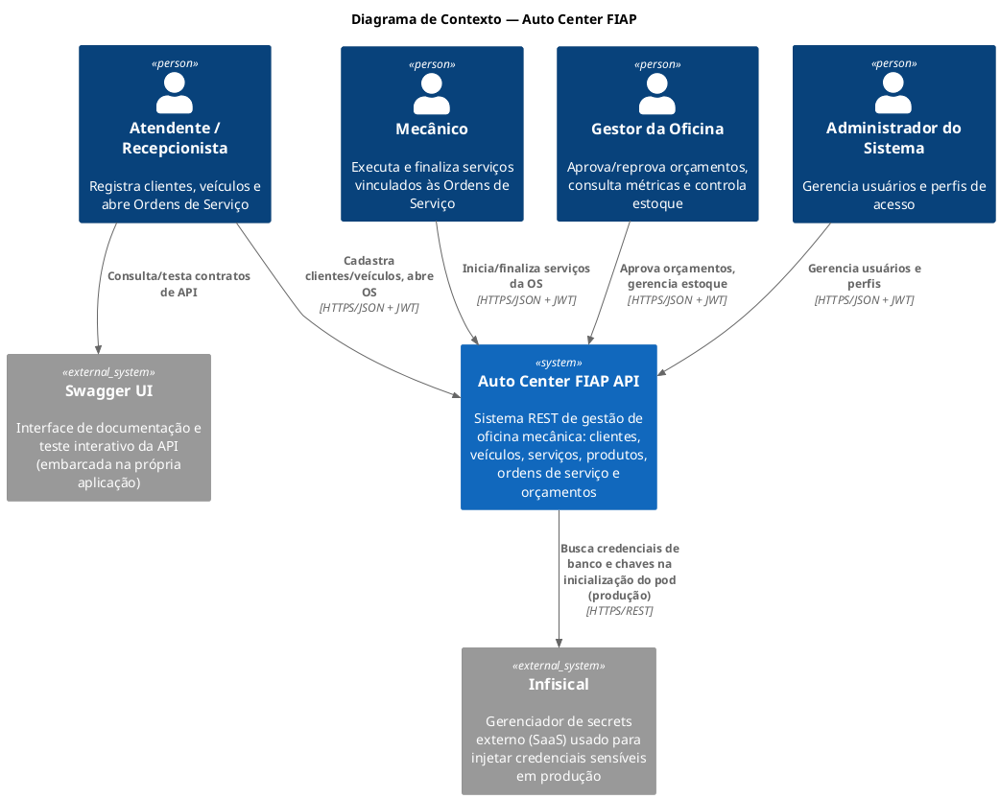
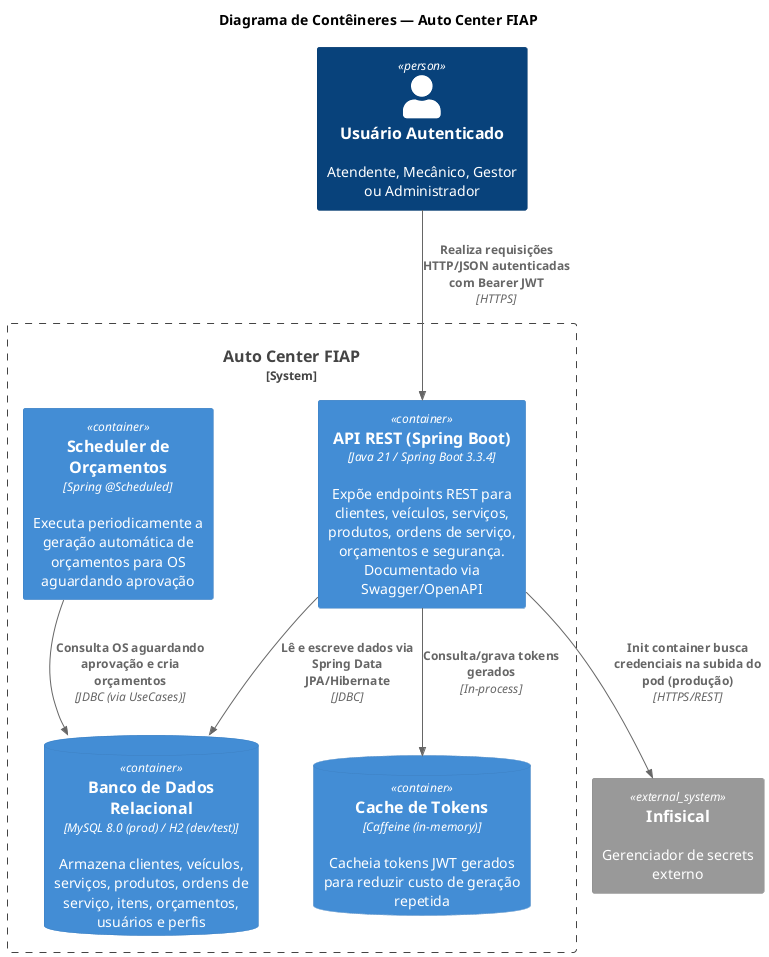
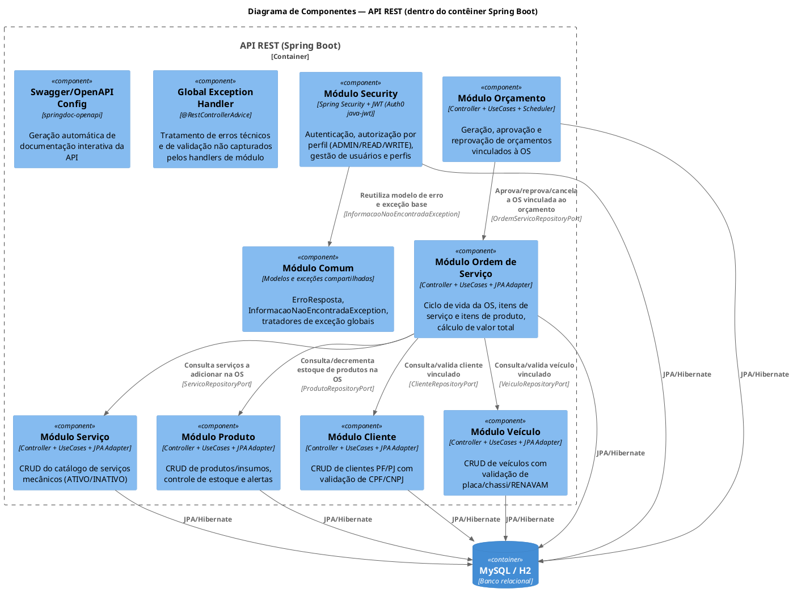
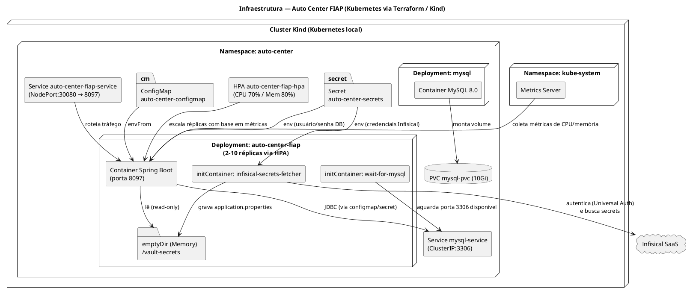
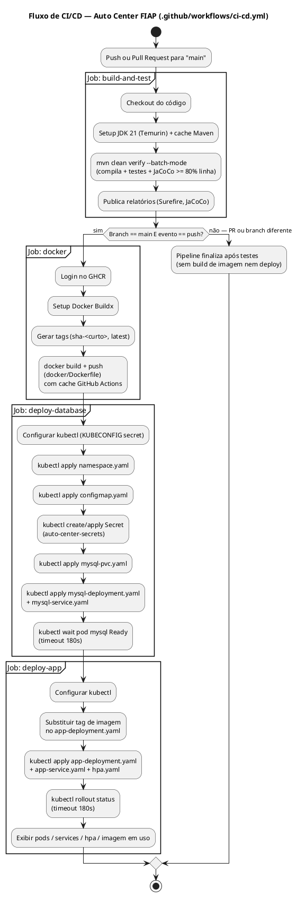

<h1 align="center">🚗 Auto Center FIAP — Documentação Técnica</h1>

<p align="center">
  
  
  
  
  
  
</p>

> Documentação técnica gerada a partir da análise integral do código-fonte, dos manifests de infraestrutura (Docker, Kubernetes, Terraform), do pipeline de CI/CD e das migrations de banco de dados presentes no repositório. Nenhum componente, endpoint ou recurso aqui descrito é hipotético — tudo foi extraído diretamente da implementação.

---

## Sumário

1. [Descrição do Projeto](#1-descrição-do-projeto)
2. [Arquitetura da Solução](#2-arquitetura-da-solução)
3. [Componentes da Aplicação](#3-componentes-da-aplicação)
4. [Infraestrutura](#4-infraestrutura)
5. [Fluxo de Deploy](#5-fluxo-de-deploy)
6. [Execução Local](#6-execução-local)
7. [Deploy Kubernetes](#7-deploy-kubernetes)
8. [Terraform](#8-terraform)
9. [APIs](#9-apis)
10. [Estrutura do Projeto](#10-estrutura-do-projeto)
11. [Tecnologias Utilizadas](#11-tecnologias-utilizadas)
12. [Decisões Técnicas](#12-decisões-técnicas)
13. [Melhorias Futuras](#13-melhorias-futuras)

---

## 1. Descrição do Projeto

### 1.1 Objetivo do Sistema

O **Auto Center FIAP** é uma API REST para gestão integral de uma oficina mecânica automotiva. O sistema cobre o ciclo de vida completo de um atendimento de oficina: cadastro de clientes (pessoa física e jurídica), cadastro de veículos, catálogo de serviços mecânicos, controle de estoque de produtos/insumos, abertura e acompanhamento de Ordens de Serviço (OS), geração e aprovação de orçamentos, e autenticação/autorização de usuários internos via JWT.

### 1.2 Problema Resolvido

Oficinas mecânicas tradicionalmente controlam clientes, veículos, peças e ordens de serviço de forma manual ou fragmentada (planilhas, sistemas desconectados), o que gera:

- Falta de rastreabilidade do ciclo de vida de uma Ordem de Serviço (da abertura à entrega);
- Ausência de controle automatizado de estoque (entradas/saídas, alertas de estoque baixo/zerado);
- Inexistência de um fluxo formal de orçamento (geração, aprovação/reprovação do cliente) atrelado ao status da OS;
- Falta de controle de acesso e auditoria sobre quem pode criar, alterar ou remover informações sensíveis (dados de clientes, valores de serviços, estoque).

O Auto Center FIAP resolve esses problemas centralizando as regras de negócio da oficina em uma API única, com controle transacional garantido pelo banco relacional, regras de domínio explícitas (ex.: não é possível excluir um cliente/veículo/serviço vinculado a uma OS ativa) e uma máquina de estados formal para o ciclo de vida da Ordem de Serviço e do Orçamento.

### 1.3 Objetivos desta Fase do Projeto

Com base no que está implementado no repositório, os objetivos entregues nesta fase são:

- Modelagem de domínio em **Clean Architecture / Arquitetura Hexagonal**, isolando regras de negócio de frameworks e de infraestrutura;
- Implementação de todos os fluxos transacionais de uma oficina: Cliente, Veículo, Produto (com controle de estoque), Serviço, Ordem de Serviço (com itens de serviço e itens de produto), Orçamento (geração automática via *scheduler*, aprovação/reprovação) e Segurança (usuários, perfis e autenticação JWT);
- Cobertura de testes automatizados (unitários com JUnit5/Mockito e de integração com `@SpringBootTest`/`@DataJpaTest`), com *gate* de qualidade mínimo de **80% de cobertura de linha** via JaCoCo;
- Containerização da aplicação com Docker multi-stage;
- Provisionamento de infraestrutura como código com **Terraform**, criando um cluster Kubernetes local (Kind), realizando build/push da imagem e aplicando todos os recursos Kubernetes de forma automatizada;
- Pipeline de **CI/CD** via GitHub Actions cobrindo build, testes, build/push de imagem Docker (GHCR) e deploy automatizado em Kubernetes;
- Documentação interativa da API via Swagger/OpenAPI (springdoc).

---

## 2. Arquitetura da Solução

### 2.1 Padrão Arquitetural Utilizado

O projeto adota **Arquitetura Hexagonal (Ports & Adapters) combinada com Clean Architecture**, aplicada de forma consistente em todos os módulos de domínio (`cliente`, `veiculo`, `servico`, `produto`, `ordemservico`, `orcamento`, `security`). Cada módulo segue o mesmo empacotamento:

```
<modulo>/
├── domain/
│   ├── entity/         → Entidades de domínio puras (POJOs), sem anotações JPA
│   ├── enums/           → Enumerações de domínio
│   ├── exception/       → Exceções de regra de negócio (DomainException)
│   └── service/         → Interfaces de regras de domínio (ex: ValidadorDocumento)
├── application/
│   ├── usecase/         → Casos de uso (orquestração da regra de negócio)
│   ├── dto/             → Input/Output dos casos de uso (desacoplados de JPA e de REST)
│   ├── mapper/           → Conversão entre entidade de domínio e DTOs de aplicação
│   ├── port/             → Interfaces (contratos) que a camada de aplicação exige da infraestrutura
│   └── validator/        → Validadores de regra de negócio plugáveis (Strategy)
├── infrastructure/
│   ├── persistence/jpa/
│   │   ├── entity/       → Entidades JPA (anotadas com @Entity), independentes da entidade de domínio
│   │   ├── repository/   → Spring Data JpaRepository
│   │   ├── mapper/       → Conversão entre entidade JPA e entidade de domínio
│   │   └── adapter/      → Implementação dos "ports" de repositório (Adapter)
│   ├── config/           → Configuração Spring (@Configuration, definição de Beans de UseCase)
│   └── validator/        → Implementações concretas de validação (ex: ValidadorCpf, ValidadorCnpj)
└── adapter/in/
    ├── (Controller).java → Controladores REST (Spring MVC)
    ├── dto/               → Request/Response DTOs expostos via HTTP
    ├── mapper/            → Conversão entre DTO HTTP e DTO de aplicação
    └── exception/         → @RestControllerAdvice específico do módulo
```

Essa organização é a materialização literal do padrão **Ports & Adapters**:

- **Domínio (núcleo):** não depende de nada — nem de Spring, nem de JPA, nem de bibliotecas de terceiros (exceto Lombok, usado apenas para reduzir boilerplate de getters/setters/builders). Contém as regras de negócio invariantes (ex.: `Cliente.validarDominio()`, `Produto.decrementarEstoque()`, `StatusOS.podeMudarPara()`, `Orcamento.aprovar()`).
- **Aplicação (casos de uso):** orquestra o domínio através de **ports** (interfaces), como `ClienteRepositoryPort`, `ProdutoRepositoryPort`, `OrdemServicoRepositoryPort`. Os casos de uso (`CriarClienteUseCase`, `AdicionarServicoOrdemServicoUseCase`, `GerarOrcamentoUseCase` etc.) são classes simples (não gerenciadas diretamente por anotação de estereótipo Spring na maioria dos módulos — são registradas como `@Bean` explícito em classes `@Configuration`), o que reforça o desacoplamento de framework.
- **Infraestrutura (adapters de saída):** implementa os ports definidos pela aplicação, usando Spring Data JPA. Cada `XxxRepositoryJpaAdapter` traduz entidades JPA (`XxxJpaEntity`) para entidades de domínio (`Xxx`) e vice-versa através de *mappers* estáticos dedicados (`XxxJpaMapper`).
- **Adapters de entrada:** os `Controller` REST são o único ponto de entrada HTTP. Eles chamam diretamente os casos de uso e traduzem DTOs HTTP (`XxxRequestDTO`/`XxxResponseDTO`) para DTOs de aplicação (`XxxInput`/`XxxOutput`) através de mappers estáticos (`XxxAdapterMapper`).

### 2.2 Responsabilidades de Cada Camada

| Camada | Responsabilidade | Exemplo real no código |
|---|---|---|
| `domain` | Regras de negócio invariantes, validação de estado, transições permitidas | `StatusOS.podeMudarPara()`, `Produto.decrementarEstoque()`, `Cliente.validarDocumentoPorTipo()` |
| `application.usecase` | Orquestração de um fluxo de negócio ponta a ponta (buscar → validar → persistir) | `CriarOrdemServicoUseCase`, `AprovarOrcamentoUseCase`, `AdicionarProdutoNaOrdemServicoUseCase` |
| `application.port` | Contrato que a aplicação exige da infraestrutura (inversão de dependência) | `OrdemServicoRepositoryPort`, `ProdutoRepositoryPort`, `TokenPort` |
| `application.validator` | Validações plugáveis de regra de negócio, aplicadas via *Strategy* (lista de `OrdemServicoValidator`) | `OrdemServicoDuplicadaValidator`, `ClienteValidator`, `VeiculoValidator` |
| `infrastructure.persistence` | Implementação de persistência (JPA/Hibernate), tradução domínio ↔ entidade JPA | `ProdutoRepositoryJpaAdapter`, `OrdemServicoJpaMapper` |
| `infrastructure.config` | *Wiring* de Beans Spring (Configuration classes registram manualmente os UseCases) | `OrdemServicoConfiguration`, `ProdutoConfiguration`, `OrcamentoConfiguration` |
| `adapter.in` (Controller) | Exposição HTTP/REST, tradução de DTOs de borda, documentação Swagger | `ClienteController`, `OrdemServicoController`, `OSItemServicoController` |
| `adapter.exception` / `handler` | Tratamento centralizado de exceções por módulo (`@RestControllerAdvice`) | `ClienteExceptionHandler`, `ProdutoExceptionHandler`, `OrdemServicoExceptionHandler`, `GlobalExceptionHandler` |

### 2.3 Comunicação entre Componentes

- **Cliente HTTP → Controller:** requisições REST autenticadas via `Authorization: Bearer <JWT>` (exceto endpoints públicos: Swagger, H2 Console, `/v1/oauth/token`, `/v1/oauth/refresh-token`).
- **Controller → UseCase:** chamada direta em memória (mesmo processo, sem mensageria).
- **UseCase → Port → Adapter → JPA → MySQL/H2:** persistência via Spring Data JPA/Hibernate.
- **Comunicação entre módulos (bounded contexts):** módulos se comunicam entre si através dos **ports de aplicação** de outros módulos (nunca acessando entidades JPA de outro módulo diretamente pela camada de domínio). Exemplo: `CriarOrdemServicoUseCase` depende de `ClienteRepositoryPort`, `VeiculoRepositoryPort`, `ProdutoRepositoryPort` e `ServicoRepositoryPort` — todos ports de outros módulos, injetados por composição.
- **Segurança:** um `OncePerRequestFilter` (`FiltroTokenAcesso`) intercepta toda requisição, extrai o token JWT do header `Authorization`, valida via `TokenPort` (implementado por `Auth0TokenAdapter`, usando `com.auth0:java-jwt`) e popula o `SecurityContextHolder` com o usuário autenticado e seus perfis (`PerfilJpaEntity` implementa `GrantedAuthority`).
- **Cache:** tokens gerados são cacheados via **Caffeine** (`@Cacheable(value = "tokens")`), com expiração configurável (`sistema.cache.expiracao.minutos`).
- **Scheduler:** `OrcamentoScheduler` executa periodicamente (`@Scheduled(fixedDelayString = "${orcamento.scheduler.fixedDelay}")`) o caso de uso `GerarOrcamentoUseCase`, que varre as Ordens de Serviço em status `AGUARDANDO_APROVACAO` e gera automaticamente um `Orcamento` para aquelas que ainda não possuem um orçamento pendente.

### 2.4 Decisões Arquiteturais

1. **Separação entre entidade de domínio e entidade JPA.** Cada módulo mantém uma entidade de domínio "pura" (`Cliente`, `Produto`, `OrdemServico`) e uma entidade JPA equivalente (`ClienteJpaEntity`, `ProdutoJpaEntity`, `OrdemServicoJpaEntity`), com mappers estáticos convertendo entre as duas. Isso permite que a regra de negócio (`validarDominio()`, `decrementarEstoque()`) seja testada sem subir contexto Spring/JPA.
2. **Injeção de casos de uso via `@Configuration` explícita**, e não via `@Service`/`@Component` nos próprios UseCases (na maioria dos módulos). Isso mantém a camada de aplicação totalmente livre de anotações do Spring, sendo o *wiring* uma responsabilidade exclusiva da camada de infraestrutura (`XxxConfiguration`).
3. **Validators plugáveis via lista (`List<OrdemServicoValidator>`)** injetada no `CriarOrdemServicoUseCase`, permitindo adicionar novas regras de validação de criação de OS (duplicidade por veículo, existência de cliente, existência de veículo) sem alterar o caso de uso principal — aplicação do princípio Open/Closed.
4. **Máquina de estados explícita no enum `StatusOS`**, com o método `podeMudarPara(StatusOS novoStatus)` centralizando todas as transições válidas do ciclo de vida da Ordem de Serviço, lançando `StatusOSInvalidoException` em transições inválidas.
5. **Tratamento de exceções descentralizado por módulo, mas com fallback global.** Cada módulo possui seu próprio `@RestControllerAdvice` com `@Order(Ordered.HIGHEST_PRECEDENCE)` restrito ao seu `basePackages`, enquanto o `GlobalExceptionHandler` (em `br.com.autocenterfiap.handler`) atua como *catch-all* (`@Order(Ordered.LOWEST_PRECEDENCE)`) para `MethodArgumentNotValidException`, `IllegalArgumentException` e `Exception` genérica.
6. **Snapshot de preço no momento da transação.** `OSItemServico.valorItemServico` e `OSItemProduto.precoUnitarioNoMomento` são gravados no momento em que o item é adicionado à Ordem de Serviço, preservando o valor histórico mesmo que o preço do serviço/produto mude posteriormente no catálogo.
7. **Perfis de execução via Spring Profiles** (`dev`, `prod`, `test`): `application-dev.properties` usa H2 em memória; `application-prod.properties` usa MySQL; `application-test.properties` (em `src/test/resources`) usa H2 para testes de integração com Flyway aplicando migrations equivalentes localizadas em `src/test/resources/db/migration` (arquivos `R__` — *repeatable migrations* do Flyway).
8. **Gestão de secrets desacoplada do Kubernetes puro.** Em produção, o Deployment utiliza um *init container* que autentica no **Infisical** (gerenciador de secrets externo) via Universal Auth e grava as credenciais em `/vault-secrets/application.properties`, montado em um volume `emptyDir` do tipo `Memory` (nunca persistido em disco).

### 2.5 Diagramas C4 Model (PlantUML)

#### 2.5.1 Diagrama de Contexto (System Context)



**Explicação:** o sistema é consumido por quatro perfis de usuário internos da oficina (Atendente, Mecânico, Gestor, Administrador), todos autenticados via JWT emitido pelo próprio sistema (`/v1/oauth/token`). A infraestrutura de produção (init container do Deployment Kubernetes) se integra com o **Infisical** para buscar segredos de configuração. Adicionalmente, o **Swagger UI** está embarcado na aplicação para visualização e testes da documentação interativa da API.

#### 2.5.2 Diagrama de Contêineres (Container Diagram)



**Explicação:** a aplicação é um **monólito modular** — um único contêiner de execução (`app.jar`, Spring Boot embarcado com Tomcat) que concentra API REST, o *scheduler* de orçamentos e o cache de tokens em memória (Caffeine). A persistência é feita em um único banco relacional, com Flyway controlando o versionamento do schema (copiado para a imagem em `/app/db` no build ou apontado via classpath).

#### 2.5.3 Diagrama de Componentes (Component Diagram)



**Explicação:** cada módulo de domínio é representado como um componente autocontido (seu próprio Controller, casos de uso, ports e adapter JPA). As setas entre módulos representam dependências reais identificadas no código — por exemplo, `CriarOrdemServicoUseCase` injeta `ClienteRepositoryPort`, `VeiculoRepositoryPort`, `ProdutoRepositoryPort` e `ServicoRepositoryPort`; e `AprovarOrcamentoUseCase`/`ReprovarOrcamentoUseCase` injetam `OrdemServicoRepositoryPort` para propagar a decisão do orçamento ao status da OS (`OrdemServico.aprovar()` / `OrdemServico.cancelar()`). O módulo `comum` fornece o contrato de erro HTTP compartilhado (`ErroResposta`) e a exceção-base `InformacaoNaoEncontradaException`, herdada por exceções de "não encontrado" em múltiplos módulos (`ClienteNaoEncontradoException`, `OrcamentoNaoEncontradoException`, `UsuarioNaoEncontradoException`, `PerfilNaoEncontradoException`).

---

## 3. Componentes da Aplicação

### 3.1 API REST (Spring Boot)

- **Responsabilidade:** único ponto de entrada para todas as operações do sistema — clientes, veículos, serviços, produtos, ordens de serviço, orçamentos, usuários e autenticação.
- **Tecnologias:** Java 21, Spring Boot 3.3.4 (Web, Validation, Security, Data JPA, Cache), springdoc-openapi 2.3.0.
- **Dependências:** banco relacional (MySQL/H2), cache Caffeine, biblioteca JWT (Auth0 java-jwt).
- **Ponto de entrada:** `br.com.autocenterfiap.StartApplication` (`@SpringBootApplication`, `@EnableCaching`, `@EnableScheduling`, `@EnableJpaAuditing`, `@EnableJpaRepositories`, `@EntityScan`).

### 3.2 Banco de Dados

- **Responsabilidade:** persistência transacional de todo o domínio da oficina.
- **Tecnologias:**
  - **MySQL 8.0** em produção (`application-prod.properties`, driver `com.mysql.cj.jdbc.Driver`);
  - **H2 em memória** em desenvolvimento (`application-dev.properties`, modo `MODE=MySQL`) e em testes (`application-test.properties`);
  - **Flyway** (`flyway-core` + `flyway-mysql`) controla o versionamento incremental do schema (`db/migration/V1` a `V12`), com `baseline-on-migrate=true`.
- **Dependências:** nenhuma — é o componente terminal da cadeia de persistência.

### 3.3 Serviços de Domínio (Casos de Uso)

Cada módulo expõe seus casos de uso como classes simples de aplicação, sem acoplamento a frameworks:

| Módulo | Casos de uso principais |
|---|---|
| Cliente | `CriarClienteUseCase`, `AtualizarClienteUseCase`, `BuscarClientePorIdUseCase`, `BuscarClientePorDocumentoUseCase`, `ListarClientesUseCase`, `DeletarClienteUseCase` |
| Veículo | `CriarVeiculoUseCase`, `AtualizarVeiculoUseCase`, `BuscarVeiculoPorIdUseCase`, `BuscarVeiculoPorPlacaUseCase`, `ListarVeiculosUseCase`, `DeletarVeiculoUseCase` |
| Serviço | `CriarServicoUseCase`, `AtualizarServicoUseCase`, `BuscarServicoPorIdUseCase`, `ListarServicosUseCase`, `ListarServicosPorStatusUseCase`, `DeletarServicoUseCase` |
| Produto | `CriarProdutoUseCase`, `AtualizarProdutoUseCase`, `BuscarProdutoPorIdUseCase`, `ListarProdutosUseCase`, `AdicionarEstoqueUseCase`, `RemoverEstoqueUseCase`, `DesativarProdutoUseCase`, `ListarAlertasEstoqueUseCase` |
| Ordem de Serviço | `CriarOrdemServicoUseCase`, `AtualizarOrdemServicoUseCase`, `BuscarOrdemServicoPorIdUseCase`, `BuscarOrdemServicoPorNumeroUseCase`, `ListarTodasOrdensServicosUseCase`, `DeletarOrdemServicoUseCase` |
| Item de Serviço da OS | `AdicionarServicoOrdemServicoUseCase`, `RemoverServicoDaOrdemServicoUseCase`, `IniciarServicoUseCase`, `FinalizarServicoUseCase`, `ListarTodosPorOrdemServicoUseCase`, `BuscarMetricasTempoGastoServicoUseCase` |
| Item de Produto da OS | `AdicionarProdutoNaOrdemServicoUseCase`, `AtualizarQuantidadeUseCase`, `RemoverProdutoNaOrdemServicoUseCase`, `ListarTodosPorOrdemServicoUseCase` |
| Orçamento | `CriarOrcamentoUseCase`, `GerarOrcamentoUseCase`, `AprovarOrcamentoUseCase`, `ReprovarOrcamentoUseCase`, `BuscarOrcamentoPorIdUseCase`, `BuscarTodosOrcamentosUseCase` |
| Segurança | `SalvarUsuarioUseCase`, `BuscarUsuarioPorNomeUseCase`, `BuscarUsuarioComPerfisUseCase`, `AlterarSenhaUseCase` |

### 3.4 Workers / Jobs Agendados

- **`OrcamentoScheduler`** (`@Scheduled(fixedDelayString = "${orcamento.scheduler.fixedDelay}")`): executa periodicamente `GerarOrcamentoUseCase.executar()`, que consulta todas as Ordens de Serviço com status `AGUARDANDO_APROVACAO` (paginado, 100 por vez) e cria um `Orcamento` no status `AGUARDANDO_APROVACAO` para cada OS que ainda não possua orçamento pendente. O intervalo é parametrizado via propriedade `orcamento.scheduler.fixedDelay` (60000 ms nos três perfis — dev, test e prod).

### 3.5 Cache

- **Caffeine** (`com.github.ben-manes.caffeine`), configurado em `CacheConfig` (`security.infrastructure.config`): cache nomeado `"tokens"`, com expiração após escrita (`expireAfterWrite`) configurável via `sistema.cache.expiracao.minutos` (25 minutos nos perfis padrão) e tamanho máximo de 1000 entradas. Usado por `Auth0TokenAdapter.gerarToken()` (`@Cacheable`) e invalidado por `limparCache()` (`@CacheEvict`).

### 3.6 Serviços Externos

- **Infisical** (`https://app.infisical.com`): utilizado exclusivamente pela infraestrutura Kubernetes/Terraform, através de um *init container* Alpine que autentica via **Universal Auth** (Client ID/Secret) e busca segredos do projeto/ambiente configurado, gravando-os em `/vault-secrets/application.properties` para serem lidos pelo Spring Boot via `SPRING_CONFIG_ADDITIONAL_LOCATION`.
- **Swagger UI / OpenAPI** (springdoc): embarcado na própria aplicação, expõe a documentação interativa em `/swagger-ui.html` (ou `/swagger-ui/index.html`) e o contrato OpenAPI em `/api-docs`.

---

## 4. Infraestrutura

A infraestrutura é provisionada de **duas formas alternativas**, ambas presentes no repositório:

1. **Terraform (caminho recomendado, conforme `README.md` e `terraform/README.md`)** — cria o cluster Kubernetes local (Kind), realiza o build/push da imagem Docker e provisiona todos os recursos Kubernetes via providers `kubernetes`/`helm`.
2. **Manifests Kubernetes puros (`k8s/`)** — alternativa para clusters já existentes, aplicados manualmente via `kubectl apply` ou Kustomize.

Ambos os caminhos convergem para o mesmo conjunto lógico de recursos, descrito a seguir.

### 4.1 Kubernetes

| Recurso | Manifesto / Terraform | Descrição |
|---|---|---|
| Namespace | `k8s/namespace.yaml` / `kubernetes_namespace.auto_center` | Namespace `auto-center`, isola todos os recursos da aplicação |
| ConfigMap | `k8s/configmap.yaml` / `kubernetes_config_map.auto_center` | Variáveis não sensíveis: profile ativo (`prod`), porta, URL JDBC, config Flyway/Hibernate, `SPRING_CONFIG_ADDITIONAL_LOCATION` |
| Secret | `k8s/secret.yaml` (referenciado no README do k8s, não versionado — está no `.gitignore`) / `kubernetes_secret.auto_center` | Credenciais MySQL (root/app) e credenciais do Infisical (Client ID/Secret/Project ID) |
| PVC | `k8s/mysql-pvc.yaml` / `kubernetes_persistent_volume_claim.mysql` | Volume persistente de 10Gi para dados do MySQL (`ReadWriteOnce`) |
| Deployment MySQL | `k8s/mysql-deployment.yaml` / `kubernetes_deployment.mysql` | MySQL 8.0, estratégia `Recreate` (compatível com PVC RWO), liveness/readiness via `mysqladmin ping` / `mysql -e 'SELECT 1'` |
| Service MySQL | `k8s/mysql-service.yaml` / `kubernetes_service.mysql` | `ClusterIP`, porta 3306, acesso interno apenas |
| Deployment App | `k8s/app-deployment.yaml` / `kubernetes_deployment.app` | 2 réplicas (padrão), `RollingUpdate` (`maxSurge=1`, `maxUnavailable=0`), 2 init containers (`wait-for-mysql`, `infisical-secrets-fetcher`), liveness/readiness/startup probes em `/actuator/health/*` (manifesto YAML) ou TCP/HTTP (`kubernetes.tf`) |
| Service App | `k8s/app-service.yaml` (`LoadBalancer`) ou `kubernetes_service.app` (`NodePort`, porta 30080) | Exposição da API |
| HPA | `k8s/hpa.yaml` / `kubernetes_horizontal_pod_autoscaler_v2.app` | Autoscaling 2–10 réplicas, baseado em CPU (70%) e memória (80%), com política de scale-up/scale-down assimétrica |
| Kustomize | `k8s/kustomization.yaml` | Orquestra a aplicação ordenada de todos os manifests com labels comuns (`managed-by: kustomize`) |

**Volumes:** apenas dois tipos de volume são usados — `PersistentVolumeClaim` (dados do MySQL, 10Gi) e `emptyDir` com `medium: Memory` (segredos do Infisical, nunca gravados em disco persistente, apenas em RAM do pod).

**Ingress:** A exposição externa é configurada diretamente via `Service` do tipo `LoadBalancer` (manifesto `k8s/app-service.yaml`, indicado para ambientes em nuvem) ou `NodePort` na porta `30080` (Terraform, utilizado no cluster Kind local).

**Secrets:** compostos por credenciais de banco (`MYSQL_ROOT_PASSWORD`, `MYSQL_DATABASE`, `MYSQL_USER`, `MYSQL_PASSWORD`) e credenciais do Infisical (`INFISICAL_CLIENT_ID`, `INFISICAL_CLIENT_SECRET`, `INFISICAL_PROJECT_ID`). As credenciais de banco são também injetadas diretamente como variáveis de ambiente (`SPRING_DATASOURCE_USERNAME`/`SPRING_DATASOURCE_PASSWORD`) no container principal, garantindo precedência sobre qualquer valor equivalente vindo do arquivo gerado pelo Infisical.

### 4.2 Terraform

Provisiona a infraestrutura completa localmente via **Kind** (Kubernetes-in-Docker):

1. Cluster Kind (1 control-plane + 2 workers);
2. Build e carga da imagem Docker da aplicação no cluster;
3. Download e carga da imagem do Metrics Server no cluster (necessário para o HPA funcionar em ambiente Kind, que não acessa `registry.k8s.io` diretamente);
4. Instalação do Metrics Server via Helm;
5. Todos os recursos Kubernetes descritos na seção 4.1.

### 4.3 Load Balancer

- **Terraform (Kind):** `Service` do tipo `NodePort`, porta `30080`, acessado via `kubectl port-forward` ou diretamente pelo IP do nó.
- **Manifestos k8s (alternativa):** `Service` do tipo `LoadBalancer`, porta 80 → 8097, adequado a um cluster com provedor de LoadBalancer real (cloud) ou MetalLB (on-premise).

### 4.4 Diagrama de Infraestrutura (PlantUML)



---

## 5. Fluxo de Deploy

O pipeline de CI/CD está definido em `.github/workflows/ci-cd.yml`, disparado em `push` e `pull_request` para a branch `main`, e é composto por 4 jobs sequenciais.

### 5.1 Etapas do Pipeline

1. **`build-and-test`** (sempre executado):
   - Checkout do código;
   - Setup do JDK 21 (Temurin), com cache Maven;
   - `mvn clean verify --batch-mode` — compila, executa todos os testes automatizados (JUnit5/Mockito, testes de integração `@SpringBootTest`/`@DataJpaTest`) e roda o *gate* de cobertura JaCoCo (mínimo de 80% de cobertura de linha no bundle, excluindo `StartApplication`, pacotes `config`, `dto`, `enums` e `repository/entity`);
   - Publica artefatos: relatório Surefire (`target/surefire-reports/`) e relatório JaCoCo (`target/site/jacoco/`).

2. **`docker`** (apenas em push para `main`, depende de `build-and-test`):
   - Login no **GitHub Container Registry (GHCR)** usando `GITHUB_TOKEN`;
   - Setup do Docker Buildx;
   - Geração de metadados/tags da imagem (`sha-<shortsha>` e `latest`);
   - Build e push da imagem usando `docker/Dockerfile`, com cache de camadas via GitHub Actions cache (`type=gha`).

3. **`deploy-database`** (apenas em push para `main`, depende de `docker`, ambiente `production`):
   - Configura `kubectl` com o `KUBECONFIG` armazenado em secret do GitHub;
   - Aplica `namespace.yaml` e `configmap.yaml`;
   - Cria/atualiza o `Secret` `auto-center-secrets` via `kubectl create secret ... --dry-run=client -o yaml | kubectl apply -f -` (idempotente), a partir de GitHub Secrets (`MYSQL_ROOT_PASSWORD`, `MYSQL_USER`, `MYSQL_PASSWORD`, credenciais Infisical);
   - Aplica o PVC e o Deployment/Service do MySQL;
   - Aguarda o pod do MySQL ficar `Ready` (timeout de 180s).

4. **`deploy-app`** (apenas em push para `main`, depende de `docker` e `deploy-database`, ambiente `production`):
   - Configura `kubectl`;
   - Substitui a tag de imagem no manifesto (`auto-center-fiap:latest` → `ghcr.io/<repo>:sha-<shortsha>`);
   - Aplica `app-deployment.yaml`, `app-service.yaml` e `hpa.yaml`;
   - Aguarda o *rollout* do Deployment (`kubectl rollout status`, timeout de 180s);
   - Exibe status final: pods, services, HPA e imagem em uso.

### 5.2 Fluxograma do Processo (PlantUML)



---

## 6. Execução Local

### 6.1 Requisitos

- **Java 21** (JDK)
- **Maven** (ou usar o wrapper `./mvnw`, se presente)
- **Docker** e **Docker Compose** (para execução com MySQL local)
- Opcional, para o caminho de infraestrutura completa: **Kind**, **kubectl**, **Terraform ≥ 1.6.0**

### 6.2 Opção A — Execução rápida com H2 em memória (perfil `dev`)

Não requer banco externo; usa H2 em memória com Flyway aplicando as migrations de `db/migration`.

```bash
./mvnw spring-boot:run -Dspring-boot.run.profiles=dev
```

A API sobe em `http://localhost:8097` (porta definida em `application-dev.properties`).

- **Console H2:** `http://localhost:8097/h2-console` (habilitado apenas no perfil `dev`, path `/h2-console`, liberado no `SecurityFilterChain` via `permitAll()`).
- **Swagger UI:** `http://localhost:8097/swagger-ui.html`.

### 6.3 Opção B — Execução com MySQL via Docker Compose

```bash
cd docker/
docker-compose up -d
```

O `docker-compose.yml` sobe dois serviços:

- **`mysql`**: imagem `mysql:8.0`, banco `autocenterdb`, usuário `autocenter`/senha `autocenter123`, porta `3306` exposta, com *healthcheck* via `mysqladmin ping`;
- **`autocenterfiap`**: build a partir de `docker/Dockerfile` (contexto `..`, raiz do projeto), porta `8097` exposta, aguardando o healthcheck do MySQL (`depends_on: condition: service_healthy`), com variáveis de ambiente `SPRING_DATASOURCE_URL`, `SPRING_DATASOURCE_USERNAME`, `SPRING_DATASOURCE_PASSWORD` e `SPRING_DATASOURCE_DRIVER_CLASS_NAME` apontando para o container MySQL.

### 6.4 Variáveis de Ambiente Relevantes

| Variável | Uso | Perfil |
|---|---|---|
| `SPRING_DATASOURCE_URL` | URL JDBC do banco | prod / docker-compose |
| `SPRING_DATASOURCE_USERNAME` / `SPRING_DATASOURCE_PASSWORD` | Credenciais do banco | prod / docker-compose |
| `sistema.seguranca.chave.secreta` | Chave HMAC256 usada para assinar/validar tokens JWT (`Auth0TokenAdapter`) | todos |
| `sistema.token.expiracao.minutos` | Tempo de expiração do access token | todos (30 min) |
| `sistema.cache.expiracao.minutos` | Tempo de expiração do cache Caffeine de tokens | todos (25 min) |
| `orcamento.scheduler.fixedDelay` | Intervalo (ms) do job de geração automática de orçamentos | todos (60000 ms) |
| `SPRING_PROFILES_ACTIVE` | Seleciona o perfil ativo (`dev`, `prod`, `test`) | Docker/K8s |

### 6.5 Autenticação Local

O usuário administrador padrão é inserido pela migration `V5__cria_insere_dados_usuarios.sql`:

```bash
curl -X POST http://localhost:8097/v1/oauth/token \
  -H "Content-Type: application/json" \
  -d '{"nome": "ADMIN", "senha": "ADMIN"}'
```

A resposta contém `tokenAcesso` e `refreshToken`. Use o `tokenAcesso` no header `Authorization: Bearer <token>` para as demais chamadas, ou utilize o botão **Authorize** no Swagger UI.

### 6.6 Testes

```bash
./mvnw test
# ou, incluindo o gate de cobertura JaCoCo:
./mvnw clean verify
```

---

## 7. Deploy Kubernetes

### 7.1 Pré-requisitos

- `kubectl` configurado apontando para o cluster de destino;
- Imagem Docker já publicada em um registry acessível pelo cluster (ex.: GHCR, conforme pipeline de CI/CD);
- Metrics Server instalado no cluster (necessário para o HPA funcionar):
  ```bash
  kubectl apply -f https://github.com/kubernetes-sigs/metrics-server/releases/latest/download/components.yaml
  ```

### 7.2 Configuração de Secrets

Antes do deploy, edite `k8s/secret.yaml` (arquivo não versionado — está no `.gitignore` — deve ser criado localmente ou provido via pipeline) com os valores reais:

```yaml
stringData:
  SPRING_DATASOURCE_USERNAME: "autocenter_user"
  SPRING_DATASOURCE_PASSWORD: "SUA_SENHA_AQUI"
  MYSQL_ROOT_PASSWORD: "SUA_SENHA_ROOT_AQUI"
  MYSQL_USER: "autocenter_user"
  MYSQL_PASSWORD: "SUA_SENHA_AQUI"
  SISTEMA_SEGURANCA_CHAVE_SECRETA: "CHAVE_JWT_256_BITS"
```

### 7.3 Aplicação dos Manifests

**Opção 1 — Kustomize (recomendado):**

```bash
kubectl kustomize k8s/     # visualizar o que será aplicado
kubectl apply -k k8s/      # aplicar tudo de uma vez
```

**Opção 2 — Arquivo por arquivo, na ordem exigida pelas dependências:**

```bash
kubectl apply -f k8s/namespace.yaml
kubectl apply -f k8s/configmap.yaml
kubectl apply -f k8s/secret.yaml
kubectl apply -f k8s/mysql-pvc.yaml
kubectl apply -f k8s/mysql-deployment.yaml
kubectl apply -f k8s/mysql-service.yaml

kubectl wait --for=condition=ready pod -l app=mysql -n auto-center --timeout=120s

kubectl apply -f k8s/app-deployment.yaml
kubectl apply -f k8s/app-service.yaml
kubectl apply -f k8s/hpa.yaml
```

### 7.4 Explicação dos Manifests

| Manifesto | O que provisiona |
|---|---|
| `namespace.yaml` | Namespace `auto-center`, com labels `app: auto-center-fiap`, `environment: production` |
| `configmap.yaml` | Variáveis de configuração da aplicação e do Flyway/Hibernate (não sensíveis) |
| `secret.yaml` | Credenciais sensíveis (banco, JWT) — **não versionado no Git** |
| `mysql-pvc.yaml` | PVC de 10Gi, `ReadWriteOnce`, para os dados do MySQL |
| `mysql-deployment.yaml` | Deployment do MySQL 8.0 com liveness/readiness probes via `exec` (`mysqladmin`/`mysql -e`) |
| `mysql-service.yaml` | Service `ClusterIP` expondo a porta 3306 apenas internamente |
| `app-deployment.yaml` | Deployment da API com 2 réplicas, `RollingUpdate`, 2 init containers (`wait-for-mysql`, `infisical-secrets-fetcher`), volume `emptyDir` em RAM para os segredos do Infisical, probes de liveness/readiness/startup em `/actuator/health/*` |
| `app-service.yaml` | Service `LoadBalancer` expondo a porta 80 → 8097 |
| `hpa.yaml` | HorizontalPodAutoscaler (2–10 réplicas), CPU 70% / memória 80%, com política assimétrica de scale-up (rápido) e scale-down (conservador) |
| `kustomization.yaml` | Orquestra a ordem de aplicação de todos os recursos acima com labels comuns |

### 7.5 Monitoramento Pós-Deploy

```bash
kubectl get all -n auto-center
kubectl get pods -n auto-center -w
kubectl logs -l app=auto-center-fiap -n auto-center --tail=100 -f
kubectl get hpa -n auto-center
kubectl top pods -n auto-center
```

### 7.6 Acesso à API

```bash
kubectl get service auto-center-fiap-service -n auto-center
```

- **Swagger UI:** `http://EXTERNAL_IP/swagger-ui/index.html`
- **API Docs:** `http://EXTERNAL_IP/api-docs`
- **Health:** `http://EXTERNAL_IP/actuator/health`

### 7.7 Remoção

```bash
kubectl delete namespace auto-center
# ou
kubectl delete -k k8s/
```

---

## 8. Terraform

### 8.1 Estrutura

```
terraform/
├── main.tf                        → Cluster Kind, build/carga de imagens Docker, providers, Metrics Server (Helm)
├── kubernetes.tf                   → Todos os recursos Kubernetes da aplicação
├── variables.tf                    → Variáveis de entrada
├── outputs.tf                      → Saídas úteis pós-deploy
├── versions.tf                     → Constraints de versão dos providers
├── terraform.tfvars.example        → Modelo de configuração (copiado para terraform.tfvars, git-ignorado)
├── deploy.sh                       → Script de deploy em 2 fases (contorna problema de inicialização dos providers)
└── README.md                       → Documentação específica do módulo Terraform
```

### 8.2 Providers

Definidos em `versions.tf`:

| Provider | Origem | Versão | Uso |
|---|---|---|---|
| `kubernetes` | `hashicorp/kubernetes` | `~> 2.27` | Cria todos os recursos K8s (namespace, configmap, secret, deployments, services, HPA) |
| `helm` | `hashicorp/helm` | `~> 2.12` | Instala o Metrics Server no cluster |
| `null` | `hashicorp/null` | `~> 3.0` | Executa comandos locais (`local-exec`) para criar o cluster Kind e realizar build/push Docker |

### 8.3 Ordem de Execução (dependências explícitas via `depends_on`/`triggers`)

1. **`null_resource.kind_cluster`** — cria (ou reaproveita, se já existir) o cluster Kind com 1 control-plane + 2 workers, exporta o kubeconfig e aguarda os nós ficarem `Ready`. Possui `provisioner` de `destroy` que remove o cluster.
2. **`null_resource.docker_build_and_load`** — depende do cluster; faz `docker build` da imagem da aplicação e `kind load docker-image` para disponibilizá-la no cluster local (sem necessidade de registry externo). É re-executado se o `Dockerfile` ou o `pom.xml` mudarem (via `filemd5` nos `triggers`).
3. **Providers `kubernetes`/`helm`** — apontam para o kubeconfig do cluster Kind recém-criado (`~/.kube/config`, contexto `kind-<cluster_name>`).
4. **`null_resource.metrics_server_image_load`** — baixa a imagem do Metrics Server no host e a carrega no cluster Kind (necessário porque os nós Kind não alcançam `registry.k8s.io` diretamente).
5. **`helm_release.metrics_server`** — instala o chart `metrics-server` (repositório `kubernetes-sigs.github.io/metrics-server`), com flags específicas para Kind (`--kubelet-insecure-tls`, `--kubelet-preferred-address-types`).
6. **`kubernetes_namespace.auto_center`** (em `kubernetes.tf`) — depende do Metrics Server; cria o namespace `auto-center`.
7. **`kubernetes_config_map.auto_center`** e **`kubernetes_secret.auto_center`** — configuração e segredos da aplicação.
8. **`kubernetes_persistent_volume_claim.mysql`**, **`kubernetes_deployment.mysql`**, **`kubernetes_service.mysql`** — infraestrutura de banco.
9. **`kubernetes_deployment.app`** — depende do MySQL (deployment + service), do ConfigMap e do Secret; define os dois init containers (`wait-for-mysql`, `infisical-secrets-fetcher`) e o container principal da aplicação.
10. **`kubernetes_service.app`** — expõe a aplicação via `NodePort` (porta `30080`).
11. **`kubernetes_horizontal_pod_autoscaler_v2.app`** — depende do Metrics Server e do Deployment da aplicação; define o autoscaling.

> Devido ao problema de *chicken-and-egg* dos providers `kubernetes`/`helm` (exigem que o cluster já exista antes de inicializar), o Terraform **não deve ser aplicado em uma única chamada `terraform apply -auto-approve`**. Utilize o script `terraform/deploy.sh` ou o `Makefile` (`make deploy`), que executam o processo em 2 fases: (1) cria apenas `null_resource.kind_cluster`; (2) aplica todos os demais recursos.

### 8.4 Recursos Provisionados — Resumo

| Recurso Terraform | O que cria |
|---|---|
| `null_resource.kind_cluster` | Cluster Kubernetes local Kind (1 control-plane + 2 workers) |
| `null_resource.docker_build_and_load` | Build da imagem Docker + carga no cluster |
| `null_resource.metrics_server_image_load` | Pré-carga da imagem do Metrics Server no cluster |
| `helm_release.metrics_server` | Metrics Server (necessário para HPA) |
| `kubernetes_namespace.auto_center` | Namespace `auto-center` |
| `kubernetes_config_map.auto_center` | ConfigMap com variáveis não sensíveis |
| `kubernetes_secret.auto_center` | Secret com credenciais de banco e Infisical |
| `kubernetes_persistent_volume_claim.mysql` | PVC de 10Gi para o MySQL |
| `kubernetes_deployment.mysql` / `kubernetes_service.mysql` | MySQL 8.0 e seu Service ClusterIP |
| `kubernetes_deployment.app` / `kubernetes_service.app` | API Spring Boot (2 réplicas) e Service NodePort (30080) |
| `kubernetes_horizontal_pod_autoscaler_v2.app` | HPA (2–10 réplicas, CPU 70% / memória 80%) |

### 8.5 Variáveis Principais (`variables.tf`)

| Variável | Padrão | Descrição |
|---|---|---|
| `cluster_name` | `auto-center` | Nome do cluster Kind |
| `app_image` | `auto-center-fiap:latest` | Imagem Docker da aplicação |
| `app_replicas` | `2` | Réplicas iniciais |
| `mysql_root_password` / `mysql_password` | *(sensível, sem padrão)* | Senhas do MySQL |
| `mysql_database` | `autocenter` | Nome do banco |
| `mysql_user` | `autocenter_user` | Usuário da aplicação no MySQL |
| `infisical_client_id` / `infisical_client_secret` / `infisical_project_id` | *(sensível, sem padrão)* | Credenciais Universal Auth do Infisical |
| `infisical_environment` | `prod` | Ambiente do Infisical |
| `infisical_secret_path` | `/` | Path dos secrets no Infisical |

### 8.6 Comandos

```bash
cd terraform/
cp terraform.tfvars.example terraform.tfvars   # editar com valores reais
terraform init
./deploy.sh        # ou: make deploy (a partir da raiz do projeto)
terraform destroy -auto-approve
```

---

## 9. APIs

### 9.1 Documentação Interativa

- **Swagger UI:** `http://<host>:8097/swagger-ui.html` (ou `/swagger-ui/index.html`), configurado em `SwaggerConfig` e `SwaggerSecurityConfig` (`br.com.autocenterfiap.config` / `br.com.autocenterfiap.security.infrastructure.config`), com esquema de segurança `bearerAuth` (HTTP Bearer/JWT).
- **OpenAPI JSON:** `http://<host>:8097/api-docs`.

### 9.2 Autenticação

Todos os endpoints, à exceção dos listados como **Pública**, exigem header `Authorization: Bearer <token>` e o perfil (`ROLE_ADMIN`, `ROLE_READ` ou `ROLE_WRITE`) adequado, conforme definido em `ConfiguracoesSeguranca` (`SecurityFilterChain`).

### 9.3 Tabela de Endpoints

#### Autenticação (`/v1/oauth`) — `AutenticacaoController`

| Método | Endpoint | Descrição | Autenticação | Request | Response |
|---|---|---|---|---|---|
| POST | `/v1/oauth/token` | Autentica usuário e emite token de acesso + refresh token | Pública | `LoginRequest { nome, senha }` | `Token { tokenAcesso, refreshToken }` |
| POST | `/v1/oauth/refresh-token` | Emite novo token a partir de um refresh token válido | Pública | `RefreshToken { refreshToken }` | `Token { tokenAcesso, refreshToken }` |

#### Usuários (`/v1/usuarios`) — `UsuarioController`

| Método | Endpoint | Descrição | Autenticação | Request | Response |
|---|---|---|---|---|---|
| GET | `/v1/usuarios/{nome}` | Busca usuário por nome | ADMIN, READ | — | `UsuarioResponse` |
| POST | `/v1/usuarios` | Cadastra novo usuário | ADMIN, WRITE | `UsuarioRequest { nome, senha, perfis[] }` | `UsuarioResponse` (201) |
| PATCH | `/v1/usuarios/senha/alteracao` | Altera senha do usuário | ADMIN, WRITE | `AlteracaoSenhaRequest { nome, novaSenha }` | `UsuarioResponse` |

#### Clientes (`/v1/clientes`) — `ClienteController`

| Método | Endpoint | Descrição | Autenticação | Request | Response |
|---|---|---|---|---|---|
| GET | `/v1/clientes` | Lista clientes paginados | ADMIN, READ | Query: `page`, `size` | `PageResult<ClienteResponseDTO>` |
| GET | `/v1/clientes/{id}` | Busca cliente por ID | ADMIN, READ | — | `ClienteResponseDTO` / 404 |
| GET | `/v1/clientes/documento/{documento}` | Busca cliente por CPF/CNPJ | ADMIN, READ | — | `ClienteResponseDTO` / 404 |
| POST | `/v1/clientes` | Cadastra cliente PF/PJ | ADMIN, WRITE | `ClienteRequestDTO` | `ClienteResponseDTO` (201) / 400 / 409 |
| PUT | `/v1/clientes/{id}` | Atualiza cliente (documento imutável) | ADMIN, WRITE | `ClienteRequestDTO` | `ClienteResponseDTO` / 400 / 404 / 409 |
| DELETE | `/v1/clientes/{id}` | Remove cliente (bloqueado se em uso por OS) | ADMIN, WRITE | — | 204 / 404 / 409 |

#### Veículos (`/v1/veiculos`) — `VeiculoController`

| Método | Endpoint | Descrição | Autenticação | Request | Response |
|---|---|---|---|---|---|
| GET | `/v1/veiculos` | Lista veículos paginados | ADMIN, READ | Query: `page`, `size` | `PageResult<VeiculoResponseDTO>` |
| GET | `/v1/veiculos/{id}` | Busca veículo por ID | ADMIN, READ | — | `VeiculoResponseDTO` / 404 |
| GET | `/v1/veiculos/placa/{placa}` | Busca veículo por placa | ADMIN, READ | — | `VeiculoResponseDTO` / 404 |
| POST | `/v1/veiculos` | Cadastra veículo | ADMIN, WRITE | `VeiculoRequestDTO` | `VeiculoResponseDTO` (201) / 400 / 409 |
| PUT | `/v1/veiculos/{id}` | Atualiza veículo | ADMIN, WRITE | `VeiculoRequestDTO` | `VeiculoResponseDTO` / 400 / 404 / 409 |
| DELETE | `/v1/veiculos/{id}` | Remove veículo (bloqueado se em uso por OS ativa) | ADMIN, WRITE | — | 204 / 404 / 409 |

#### Serviços (`/v1/servicos`) — `ServicoController`

| Método | Endpoint | Descrição | Autenticação | Request | Response |
|---|---|---|---|---|---|
| POST | `/v1/servicos` | Cria serviço | ADMIN, WRITE | `ServicoRequestDTO` | `ServicoResponseDTO` (201) / 400 |
| GET | `/v1/servicos` | Lista todos os serviços paginados | ADMIN, READ | Query: `page`, `size` | `PageResult<ServicoResponseDTO>` |
| GET | `/v1/servicos/{id}` | Busca serviço por ID | ADMIN, READ | — | `ServicoResponseDTO` / 404 |
| GET | `/v1/servicos/status/{status}` | Lista serviços por status (ATIVO/INATIVO) | ADMIN, READ | — | `PageResult<ServicoResponseDTO>` |
| PUT | `/v1/servicos/{id}` | Atualiza serviço | ADMIN, WRITE | `ServicoRequestDTO` | `ServicoResponseDTO` / 404 / 400 |
| DELETE | `/v1/servicos/{id}` | Remove serviço (bloqueado se em uso) | ADMIN, WRITE | — | 204 / 404 / 409 |

#### Produtos (`/v1/produtos`) — `ProdutoController`

| Método | Endpoint | Descrição | Autenticação | Request | Response |
|---|---|---|---|---|---|
| GET | `/v1/produtos` | Lista produtos ativos, com filtro opcional de categoria/busca | ADMIN, READ | Query: `categoria`, `busca` | `List<ProdutoResponseDTO>` |
| GET | `/v1/produtos/{id}` | Busca produto por ID | ADMIN, READ | — | `ProdutoResponseDTO` / 404 |
| POST | `/v1/produtos` | Cadastra produto/insumo | ADMIN, WRITE | `ProdutoRequestDTO` | `ProdutoResponseDTO` (201) / 409 |
| PUT | `/v1/produtos/{id}` | Atualiza produto | ADMIN, WRITE | `ProdutoRequestDTO` | `ProdutoResponseDTO` / 404 / 409 |
| DELETE | `/v1/produtos/{id}` | Desativa produto (soft delete) | ADMIN, WRITE | — | 204 / 404 |
| PATCH | `/v1/produtos/{id}/estoque/adicionar` | Entrada de estoque | ADMIN, WRITE | `MovimentacaoEstoqueDTO { quantidade, motivo }` | `ProdutoResponseDTO` / 404 |
| PATCH | `/v1/produtos/{id}/estoque/remover` | Saída manual de estoque | ADMIN, WRITE | `MovimentacaoEstoqueDTO` | `ProdutoResponseDTO` / 422 (estoque insuficiente) |
| GET | `/v1/produtos/estoque/alertas` | Lista produtos com estoque baixo ou zerado | ADMIN, READ | — | `List<ProdutoResponseDTO>` |

#### Ordens de Serviço (`/v1/ordem-servicos`) — `OrdemServicoController`

| Método | Endpoint | Descrição | Autenticação | Request | Response |
|---|---|---|---|---|---|
| GET | `/v1/ordem-servicos` | Lista OS ativas, ordenadas por prioridade de status | ADMIN, READ | Query: `page`, `size` | `PageResult<OrdemServicoResponseDTO>` |
| GET | `/v1/ordem-servicos/{id}` | Busca OS por ID | ADMIN, READ | — | `OrdemServicoResponseDTO` / 404 |
| GET | `/v1/ordem-servicos/numero/{numeroOs}` | Busca OS por número | ADMIN, READ | — | `OrdemServicoResponseDTO` / 404 |
| POST | `/v1/ordem-servicos` | Cria OS (associa veículo, cliente, serviços e produtos) | ADMIN, WRITE | `OrdemServicoDTO { veiculoId, clienteId, servicosIds[], produtosIdsAndQuantidades{} }` | `OrdemServicoResponseDTO` (201) / 400 / 404 |
| PATCH | `/v1/ordem-servicos/{id}` | Atualiza status da OS (respeita máquina de estados) | ADMIN, WRITE | `OrdemServicoUpdateDTO { statusOS }` | `OrdemServicoResponseDTO` / 400 / 404 |
| DELETE | `/v1/ordem-servicos/{id}` | Remove OS | ADMIN, WRITE | — | 204 / 404 |

#### Itens de Serviço da OS (`/v1/ordem-servico/{ordemServicoId}/servicos`) — `OSItemServicoController`

| Método | Endpoint | Descrição | Autenticação | Request | Response |
|---|---|---|---|---|---|
| GET | `/v1/ordem-servico/{ordemServicoId}/servicos` | Lista serviços vinculados à OS (paginado) | ADMIN, READ | — | `Page<OSItemServicoResponseDTO>` |
| POST | `/v1/ordem-servico/{ordemServicoId}/servicos` | Adiciona serviço à OS (exige status `EM_DIAGNOSTICO`) | ADMIN, WRITE | `OSItemServicoRequestDTO { servicoId }` | `OSItemServicoResponseDTO` (201) / 400 / 404 |
| PATCH | `/v1/ordem-servico/{ordemServicoId}/servicos/{servicoId}/iniciar` | Inicia execução do item (exige OS `EM_EXECUCAO`) | ADMIN, WRITE | — | `OSItemServicoResponseDTO` / 400 / 404 |
| PATCH | `/v1/ordem-servico/{ordemServicoId}/servicos/{servicoId}/finalizar` | Finaliza execução do item | ADMIN, WRITE | — | `OSItemServicoResponseDTO` / 400 / 404 |
| DELETE | `/v1/ordem-servico/{ordemServicoId}/servicos/{servicoId}` | Remove item (exige OS `EM_DIAGNOSTICO` e item `AGUARDANDO_INICIO`) | ADMIN, WRITE | — | 204 / 400 / 404 |

#### Itens de Produto da OS (`/v1/ordem-servicos/{osId}/produtos`) — `OSItemProdutoController`

| Método | Endpoint | Descrição | Autenticação | Request | Response |
|---|---|---|---|---|---|
| GET | `/v1/ordem-servicos/{osId}/produtos` | Lista produtos vinculados à OS (paginado) | ADMIN, READ | — | `Page<OSItemProdutoResponseDTO>` |
| POST | `/v1/ordem-servicos/{osId}/produtos` | Vincula produto à OS e decrementa estoque | ADMIN, WRITE | `OSItemProdutoRequestDTO { produtoId, quantidade }` | `OSItemProdutoResponseDTO` (201) / 400 / 404 / 422 |
| PUT | `/v1/ordem-servicos/{osId}/produtos/{produtoId}` | Atualiza quantidade (ajusta estoque proporcionalmente) | ADMIN, WRITE | `OSItemProdutoRequestDTO` | `OSItemProdutoResponseDTO` / 404 / 422 |
| DELETE | `/v1/ordem-servicos/{osId}/produtos/{produtoId}` | Remove produto da OS e devolve estoque | ADMIN, WRITE | — | 204 / 404 |

#### Orçamentos (`/v1/orcamentos`) — `OrcamentoController`

| Método | Endpoint | Descrição | Autenticação | Request | Response |
|---|---|---|---|---|---|
| GET | `/v1/orcamentos` | Lista orçamentos filtrados por status (paginado) | ADMIN, READ | Query: `status` (obrigatório) | `PageResult<OrcamentoResponse>` |
| GET | `/v1/orcamentos/{id}` | Busca orçamento por ID | ADMIN, READ | — | `OrcamentoResponse` / 404 |
| PATCH | `/v1/orcamentos/{id}/aprovar` | Aprova orçamento e a OS vinculada | ADMIN, WRITE | — | `OrcamentoResponse` / 404 |
| PATCH | `/v1/orcamentos/{id}/reprovar` | Reprova orçamento e cancela a OS vinculada | ADMIN, WRITE | — | `OrcamentoResponse` / 404 |
| POST | `/v1/orcamentos/{id}/enviar-cliente` | Simula envio do orçamento ao cliente | ADMIN, WRITE | `EnvioRequest { tipo: EMAIL\|WHATSAPP\|IMPRESSORA }` | `String` (mensagem de confirmação) |

#### Métricas (`/v1/ordem-servico/metricas`) — `MetricasController`

| Método | Endpoint | Descrição | Autenticação | Request | Response |
|---|---|---|---|---|---|
| GET | `/v1/ordem-servico/metricas/servicos` | Tempo médio de execução por tipo de serviço finalizado | ADMIN, READ | Query: `page`, `size` | `PageResult<MetricaTempoGastoServicoDTO>` |

---

## 10. Estrutura do Projeto

```
auto-center-fiap/
├── src/main/java/br/com/autocenterfiap/
│   ├── StartApplication.java              → Bootstrap Spring Boot
│   ├── config/                            → SwaggerConfig (documentação OpenAPI)
│   ├── handler/                           → GlobalExceptionHandler (fallback de erros)
│   ├── comum/                             → ErroResposta, InformacaoNaoEncontradaException (compartilhados)
│   ├── util/                              → Util (cálculo de valor total da OS)
│   ├── cliente/                           → Módulo Cliente (domain/application/infrastructure/adapter)
│   ├── veiculo/                           → Módulo Veículo
│   ├── servico/                           → Módulo Serviço
│   ├── produto/                           → Módulo Produto/Estoque
│   ├── ordemservico/                      → Módulo Ordem de Serviço (+ subpacotes OSItemServico, OSItemProduto)
│   ├── orcamento/                         → Módulo Orçamento (+ scheduler)
│   └── security/                          → Módulo de Segurança (JWT, usuários, perfis)
├── src/main/resources/
│   ├── application-dev.properties         → Perfil de desenvolvimento (H2)
│   └── application-prod.properties        → Perfil de produção (MySQL)
├── src/test/java/...                      → Testes unitários e de integração (espelham a estrutura de src/main)
├── src/test/resources/
│   ├── application-test.properties        → Perfil de testes (H2)
│   └── db/migration/                      → Migrations Flyway "repeatable" (R__) equivalentes às de produção
├── db/migration/                          → Migrations Flyway versionadas (V1 a V12) usadas em dev/prod
├── docker/
│   ├── Dockerfile                         → Build multi-stage (Maven → JRE Alpine)
│   └── docker-compose.yml                 → MySQL + aplicação para ambiente local
├── k8s/                                   → Manifests Kubernetes (alternativa ao Terraform)
├── terraform/                             → Infraestrutura como código (Kind + Kubernetes + Helm)
├── .github/workflows/ci-cd.yml            → Pipeline de CI/CD (GitHub Actions)
├── Makefile                                → Atalhos para o fluxo Terraform (deploy/destroy/plan/init)
├── pom.xml                                → Definição de build Maven, dependências e plugins (JaCoCo, MapStruct)
└── README.md                               → Este documento
```

---

## 11. Tecnologias Utilizadas

| Tecnologia | Versão | Finalidade |
|---|---|---|
| Java | 21 | Linguagem principal |
| Spring Boot | 3.3.4 | Framework de aplicação (Web, Validation, Data JPA, Security, Cache) |
| Spring Security | (gerenciado pelo Boot 3.3.4) | Autenticação/autorização baseada em perfis e filtro JWT customizado |
| Spring Data JPA / Hibernate | (gerenciado pelo Boot 3.3.4) | ORM e abstração de persistência |
| MySQL | 8.0 | Banco de dados relacional em produção |
| H2 Database | (gerenciado pelo Boot) | Banco em memória para desenvolvimento e testes |
| Flyway (`flyway-core`, `flyway-mysql`) | (gerenciado pelo Boot) | Versionamento e migração de schema de banco |
| Auth0 `java-jwt` | 4.4.0 | Geração e verificação de tokens JWT (HMAC256) |
| Caffeine | (gerenciado pelo Boot) | Cache em memória de tokens JWT |
| MapStruct | 1.5.5.Final | Geração de mappers (usado no módulo `security`, ex.: `UsuarioMapper`) |
| Lombok | 1.18.34 | Redução de boilerplate (getters/setters/builders/constructors) |
| springdoc-openapi (`starter-webmvc-ui`, `security`) | 2.3.0 / 1.8.0 | Documentação interativa Swagger/OpenAPI |
| JUnit 5 + Mockito (`spring-boot-starter-test`) | (gerenciado pelo Boot) | Testes unitários e de integração |
| Spring Security Test | (gerenciado pelo Boot) | `@WithMockUser` e utilitários de teste de segurança |
| JaCoCo | 0.8.11 | Cobertura de código, com *gate* mínimo de 80% de linha |
| Maven | (via `spring-boot-starter-parent`) | Build, gerenciamento de dependências e plugins |
| Docker / Docker Compose | — | Containerização da aplicação e orquestração local com MySQL |
| Kubernetes (Kind) | — | Orquestração de contêineres (cluster local para desenvolvimento/homologação) |
| Helm | — | Instalação do Metrics Server no cluster |
| Terraform | ≥ 1.6.0 | Infraestrutura como código (cluster, build de imagem, recursos K8s) |
| GitHub Actions | — | Pipeline de CI/CD |
| GitHub Container Registry (GHCR) | — | Registry de imagens Docker |
| Infisical | — | Gerenciamento externo de secrets em produção |

---

## 12. Decisões Técnicas

1. **Arquitetura Hexagonal replicada por módulo, e não uma camada única compartilhada.** Cada *bounded context* (Cliente, Veículo, Serviço, Produto, Ordem de Serviço, Orçamento, Segurança) possui sua própria hierarquia `domain/application/infrastructure/adapter`, favorecendo baixo acoplamento entre módulos e permitindo evolução/deploy independente no futuro (ex.: extração para microsserviços), mesmo operando hoje como monólito.
2. **Entidades de domínio e entidades JPA desacopladas.** Embora aumente a quantidade de classes e mappers, essa decisão garante que a regra de negócio (`Produto.decrementarEstoque()`, `Cliente.validarDominio()`) seja testável isoladamente, sem inicializar o contexto Spring ou o Hibernate — refletido nos testes unitários puros (`ClienteTest`, `ProdutoTest` implícitos via testes de UseCase com Mockito).
3. **Validators de criação de Ordem de Serviço como estratégia plugável (`List<OrdemServicoValidator>`).** Em vez de concentrar todas as validações de criação de OS num único método, o `CriarOrdemServicoUseCase` recebe uma lista de validadores (`OrdemServicoDuplicadaValidator`, `ClienteValidator`, `VeiculoValidator`) injetada via Spring, permitindo adicionar novas regras sem alterar a classe existente.
4. **Snapshot de valores no momento da transação.** Preços de serviços e produtos são copiados para o item da OS no momento da inclusão (`valorItemServico`, `precoUnitarioNoMomento`), preservando o histórico financeiro mesmo diante de reajustes futuros no catálogo.
5. **Cálculo centralizado do valor total da OS.** A classe utilitária `Util.calcularValorTotal(OrdemServico)` é reaproveitada por múltiplos casos de uso (`CriarOrdemServicoUseCase`, `AdicionarServicoOrdemServicoUseCase`, `AdicionarProdutoNaOrdemServicoUseCase`, `AtualizarQuantidadeUseCase`) para evitar duplicação e divergência de regra de cálculo.
6. **Geração automática de orçamento via *scheduler*, e não via evento síncrono.** A criação de orçamento para uma OS que atinge `AGUARDANDO_APROVACAO` não ocorre no mesmo request que muda o status da OS; em vez disso, um job periódico (`OrcamentoScheduler`) varre periodicamente as OS pendentes. Essa escolha desacopla o fluxo de atualização de status da OS da criação do orçamento, ao custo de uma pequena latência (intervalo do scheduler) até o orçamento aparecer.
7. **Tratamento de erro em duas camadas.** Handlers específicos por módulo (`@RestControllerAdvice(basePackages = "...")`, `@Order(HIGHEST_PRECEDENCE)`) tratam exceções de domínio específicas com mensagens de negócio ricas, enquanto o `GlobalExceptionHandler` (`@Order(LOWEST_PRECEDENCE)`) garante que nenhuma exceção não mapeada vaze sem uma resposta HTTP padronizada (`ErroResposta`).
8. **Gate de qualidade de 80% de cobertura via JaCoCo**, com exclusões conscientes de classes que não carregam lógica de negócio (bootstrap, `config`, `dto`, `enums`, entidades de repositório) — evitando que métricas de cobertura sejam infladas artificialmente por getters/setters gerados pelo Lombok.
9. **Infraestrutura local reprodutível via Kind + Terraform**, eliminando a necessidade de uma conta cloud para desenvolvimento e validação de toda a cadeia de deploy (incluindo HPA, que normalmente dependeria de um cloud provider gerenciado).
10. **Segurança de secrets em produção via Infisical + volume em RAM**, evitando gravar credenciais em disco persistente do pod e centralizando a rotação de segredos fora do cluster Kubernetes.

---

## 13. Melhorias Futuras

Com base em lacunas identificadas na implementação atual:

- **Ingress + TLS:** não há recurso `Ingress` nem terminação TLS configurada; toda exposição atual depende de `LoadBalancer`/`NodePort` sem HTTPS nativo no nível do cluster.
- **Observabilidade:** não há integração com stack de métricas/tracing (Prometheus/Grafana, Micrometer, OpenTelemetry) além do Actuator referenciado nos health checks; adicionar `spring-boot-starter-actuator` com métricas expostas para Prometheus traria visibilidade operacional real em produção.
- **Mensageria assíncrona:** a geração de orçamento e outras integrações futuras (ex.: notificação real ao cliente no endpoint `enviar-cliente`, hoje apenas simulado) poderiam evoluir para um modelo orientado a eventos (ex.: Kafka/RabbitMQ), desacoplando ainda mais os módulos.
- **Testes de contrato/consumidor:** não há testes de contrato (ex.: Pact) entre a API e eventuais consumidores externos.
- **Postman Collection / cliente HTTP versionado:** não há uma coleção Postman ou arquivo `.http` versionado no repositório; publicar uma coleção facilitaria testes manuais e onboarding.
- **Cloud Provider gerenciado:** migrar o Terraform de Kind (local) para um provider gerenciado (EKS/GKE/AKS) tornaria o ambiente de homologação/produção mais fiel a um cenário real de nuvem, incluindo Ingress Controller, cert-manager e um Load Balancer gerenciado.
- **Refresh token com revogação:** o fluxo atual de refresh token (`/v1/oauth/refresh-token`) não implementa lista de revogação/rotação (apenas reemite um novo par de tokens a partir da verificação de assinatura); avaliar um mecanismo de *token family*/*blacklist* para mitigar reuso de refresh tokens comprometidos.
- **Multitenancy:** o sistema atualmente atende a uma única oficina; suporte a múltiplas unidades/filiais exigiria segregação de dados por tenant.
- **Auditoria detalhada:** embora existam campos `dataCriacao`/`dataUltimaAtualizacao` via JPA Auditing, não há trilha de auditoria (quem alterou o quê) — poderia ser adicionada via Envers ou tabela de auditoria dedicada.
- **Circuit breaker/resiliência:** não há `Resilience4j` ou equivalente para chamadas à integração externa (Infisical), embora essa chamada ocorra apenas na inicialização do pod (init container) e não em tempo de requisição.
